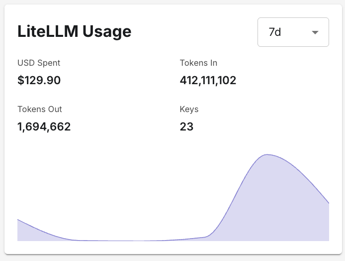
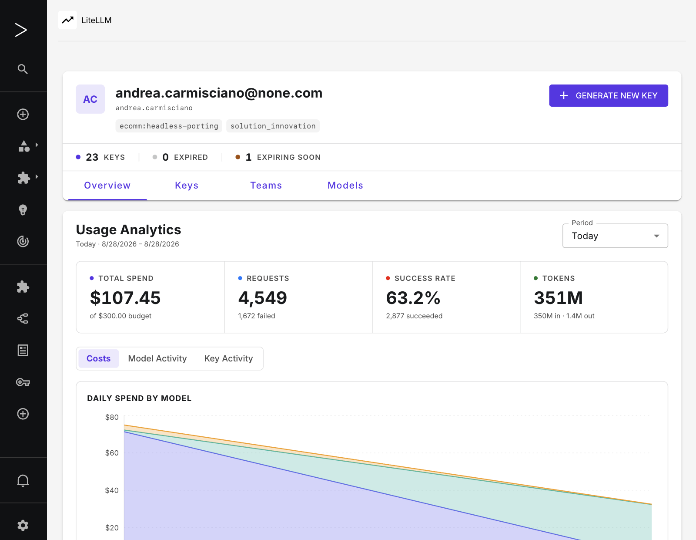
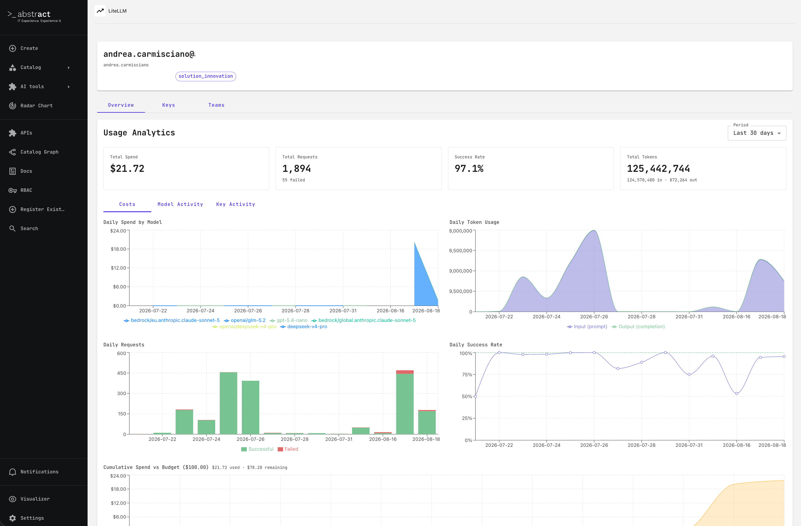
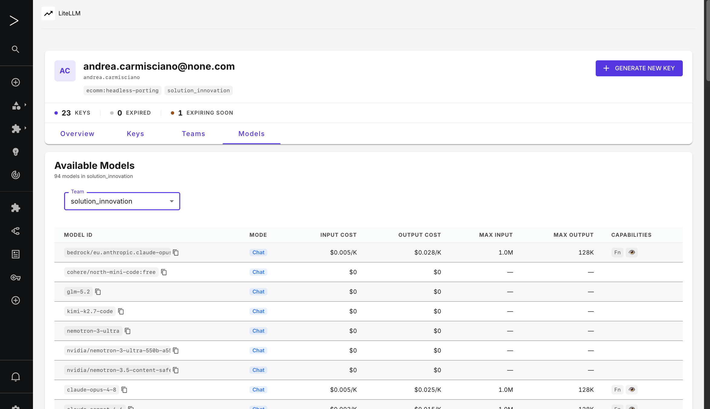
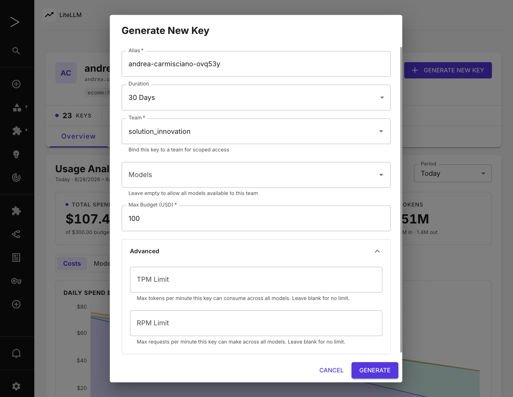
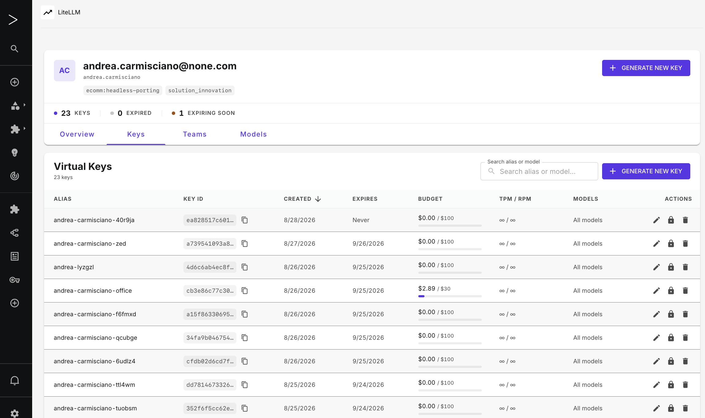
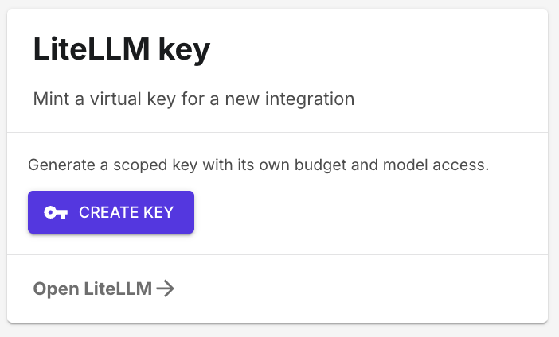

# Backstage LiteLLM Governance Plugin

Backstage plugin for LiteLLM governance — enables developers to manage virtual API keys and monitor AI model usage directly from Backstage.

## Overview

This is a Backstage 1.50+ plugin providing a governance interface for LiteLLM proxy. It includes:

- **Frontend**: React components built with the New Frontend System (`@backstage/frontend-plugin-api`)
- **Backend**: Express router using the New Backend System (`@backstage/backend-plugin-api`)

### Packages

- `packages/plugin-litellm` - Frontend (`@acarmisc/backstage-plugin-litellm`)
- `packages/plugin-litellm-backend` - Backend (`@acarmisc/backstage-plugin-litellm-backend`)

## Screenshots

### Home widget — at-a-glance usage on the Backstage homepage

The `LiteLLMHomeWidget` card surfaces the signed-in user's KPIs (USD spent, tokens in/out, active key count) alongside a daily-spend sparkline, with a `Today` / `7d` / `30d` period selector.



### Overview tab — usage analytics

The `Overview` tab is the default landing view. It shows the user's identity header (with team chips and key health counters), four KPI tiles (Total Spend, Total Requests, Success Rate, Total Tokens), and the `Costs` chart with per-model daily spend.



The full-page version below shows the complete chart grid (Daily Spend by Model, Daily Token Usage, Daily Requests, Daily Success Rate, Cumulative Spend vs Budget):



### Keys tab — virtual key inventory

Browse, edit, block, and revoke your virtual keys. Each row shows alias, key ID, creation/expiry dates, budget bar, TPM/RPM, and the models it can call.



### Generate New Key dialog

Mint a scoped key with its own budget, team binding, model list, and TPM/RPM caps. Failures (e.g. duplicate alias) surface inline with the upstream error.



### Models tab — available LLM models

Browse every model the proxy exposes, with per-model input/output cost and max input/output token limits. The team filter scopes the list to the team the key will be bound to.



### Compact "Create Key" card

A smaller variant of the home widget for surfaces that only need a one-click shortcut into the key-mint flow.



## Installation

This plugin is designed to be used **within a Backstage monorepo**. It uses workspace dependencies and requires the Backstage CLI to build.

### Option 1: Link from File

From your Backstage monorepo root:

```bash
yarn add file:../backstage-govai/packages/plugin-litellm
yarn add file:../backstage-govai/packages/plugin-litellm-backend
```

### Option 2: Copy into Plugins Directory

Copy the packages directly into your Backstage `plugins/` directory and add them to your workspace.

## Configuration

### Environment Variables

Set these in your shell or deployment environment before starting Backstage. Backstage's config system supports `${ENV_VAR}` substitution in `app-config.yaml`:

```bash
LITELLM_BASE_URL=http://litellm-proxy:4000     # LiteLLM proxy URL
LITELLM_MASTER_KEY=sk-...                      # LiteLLM admin master key
```

### App Config Schema

Add to `app-config.yaml`. All keys live under the `litellm` top-level namespace:

```yaml
litellm:
  # Required — base URL of your LiteLLM proxy instance.
  # @visibility backend
  baseUrl: ${LITELLM_BASE_URL}

  # Optional — publicly reachable LiteLLM proxy URL, used to build
  # ready-to-paste curl / OpenAI-SDK snippets in the "Key Generated" dialog.
  # Falls back to baseUrl (the internal URL) when omitted.
  # @visibility backend
  # publicBaseUrl: https://llm-gw.example.com

  # Required — LiteLLM master key for admin operations.
  # Never exposed to the frontend (marked @visibility secret).
  masterKey: ${LITELLM_MASTER_KEY}

  # Optional — email domain appended to the Backstage user entity name to form
  # the LiteLLM user_id. When set, a user entity "user:default/john.doe" maps
  # to "john.doe@example.com" in LiteLLM. Omit to use the bare entity name.
  # @visibility backend
  userIdDomain: example.com   # optional

  # Optional — autoprovisioning of LiteLLM users on first access.
  provisioning:
    # Whether to automatically create a LiteLLM user when the Backstage user
    # is not yet known to LiteLLM. Disabled by default.
    enabled: false   # default

    defaults:
      # Max lifetime spend (USD) before the account is blocked.
      maxBudget: 10          # default: 10

      # Spend-reset period after which the spend counter resets.
      # Accepts LiteLLM duration strings: "30d", "7d", "1h", etc.
      budgetDuration: 30d    # default: "30d"

      # LiteLLM model IDs the new user is allowed to call.
      # An empty list means all models configured in the proxy are allowed.
      models: []             # default: [] (all models)

      # LiteLLM team IDs to enrol the new user in automatically.
      teams: []              # default: [] (no teams)

      # LiteLLM role assigned to every provisioned user.
      # Valid values: proxy_admin, proxy_admin_viewer, internal_user,
      #               internal_user_viewer, team.
      userRole: internal_user   # default: "internal_user"

      # Tokens per minute hard cap (omit for no per-user limit).
      # tpmLimit: 100000

      # Requests per minute hard cap (omit for no per-user limit).
      # rpmLimit: 1000

      # Arbitrary key-value metadata stored on the LiteLLM user record.
      # metadata:
      #   cost_centre: engineering

    # Optional — role-based provisioning overrides.
    # Evaluated in order; first matching group wins.
    # Fields omitted here fall back to defaults above.
    roles:
      - group: group:default/ai-power-users   # Backstage group entity ref
        maxBudget: 100
        budgetDuration: 30d
        models:
          - gpt-4o
          - claude-3-5-sonnet
        userRole: internal_user

  # Optional — controls for the "Generate New Key" form in the frontend.
  keyGeneration:
    # Show the "Unlimited budget" checkbox. When false, a positive max
    # budget is always required.
    allowUnlimitedBudget: false   # default

    # Require a team to be selected before a key can be generated.
    # Set to false to allow personal, team-less keys.
    teamRequired: true   # default

  # Optional — delegated team management (see "Team Management" below).
  # The whole feature is fail-closed: it stays dark unless `permission.enabled`
  # is true AND `group` is set. Every list below is an allowlist that starts
  # empty (nothing assignable) — you must populate it explicitly.
  teamAdmin:
    # REQUIRED to enable the feature. Backstage group whose members may manage
    # teams. The plugin ships an empty group at catalog/litellm-team-admins.yaml.
    group: group:default/litellm-team-admins

    # Models / access-groups a team admin may put on a team.
    allowedModels: [gpt-4o, claude-3-5-sonnet]   # default: []
    allowedModelAccessGroups: []                 # default: []

    # Hard USD ceiling a team admin may set as a team budget.
    maxBudgetCeiling: 500                         # default: unset (no budget settable)
    allowUnlimitedBudget: false                   # default: false

    # Allow DELETE /teams/:id (otherwise the route 403s — block a team instead).
    allowTeamDelete: false                        # default: false

    # Knowledge-base (vector store) and MCP-server management. Highest-risk
    # surface — only enable with a real permission policy installed.
    objectPermissions:
      enabled: false                             # default: false
    allowedVectorStores: []                      # default: []  (vector store ids/names)
    allowedMcpServers: []                        # default: []  (MCP server ids/names)
    allowedMcpAccessGroups: []                   # default: []
```

**Config key reference:**

| Key | Type | Required | Default | Description |
|-----|------|----------|---------|-------------|
| `litellm.baseUrl` | string | yes | — | LiteLLM proxy base URL |
| `litellm.publicBaseUrl` | string | no | — | Publicly reachable proxy URL for snippet generation |
| `litellm.masterKey` | string | yes | — | Admin master key (`@visibility secret`) |
| `litellm.userIdDomain` | string | no | — | Email domain for LiteLLM user IDs |
| `litellm.provisioning.enabled` | boolean | no | `false` | Enable autoprovisioning |
| `litellm.provisioning.defaults.maxBudget` | number | no | `10` | Max spend (USD) per reset period |
| `litellm.provisioning.defaults.budgetDuration` | string | no | `"30d"` | Spend-reset period |
| `litellm.provisioning.defaults.models` | string[] | no | `[]` | Allowed model IDs (empty = all) |
| `litellm.provisioning.defaults.teams` | string[] | no | `[]` | Team IDs to join on creation |
| `litellm.provisioning.defaults.userRole` | string | no | `"internal_user"` | LiteLLM role |
| `litellm.provisioning.defaults.tpmLimit` | number | no | — | Tokens-per-minute cap |
| `litellm.provisioning.defaults.rpmLimit` | number | no | — | Requests-per-minute cap |
| `litellm.provisioning.defaults.metadata` | object | no | `{}` | Extra metadata on user record |
| `litellm.provisioning.roles[].group` | string | yes* | — | Backstage group entity ref |
| `litellm.provisioning.roles[].maxBudget` | number | no | — | Overrides default for group |
| `litellm.provisioning.roles[].budgetDuration` | string | no | — | Overrides default for group |
| `litellm.provisioning.roles[].models` | string[] | no | — | Overrides default for group |
| `litellm.provisioning.roles[].teams` | string[] | no | — | Overrides default for group |
| `litellm.provisioning.roles[].userRole` | string | no | — | Overrides default for group |
| `litellm.provisioning.roles[].tpmLimit` | number | no | — | Overrides default for group |
| `litellm.provisioning.roles[].rpmLimit` | number | no | — | Overrides default for group |
| `litellm.provisioning.roles[].metadata` | object | no | — | Merged over default metadata |
| `litellm.keyGeneration.allowUnlimitedBudget` | boolean | no | `false` | Show the "Unlimited budget" checkbox in the Generate New Key form |
| `litellm.keyGeneration.teamRequired` | boolean | no | `true` | Require a team to be selected before a key can be generated |
| `litellm.teamAdmin.group` | string | no† | — | Backstage group whose members may manage teams. Setting this + `permission.enabled` enables the feature |
| `litellm.teamAdmin.allowedModels` | string[] | no | `[]` | Models a team admin may assign to a team |
| `litellm.teamAdmin.allowedModelAccessGroups` | string[] | no | `[]` | Model access-group names a team admin may assign |
| `litellm.teamAdmin.maxBudgetCeiling` | number | no | — | Hard USD ceiling for an admin-set team budget |
| `litellm.teamAdmin.allowUnlimitedBudget` | boolean | no | `false` | Let an admin create a team with no budget cap |
| `litellm.teamAdmin.allowTeamDelete` | boolean | no | `false` | Enable `DELETE /teams/:id` |
| `litellm.teamAdmin.objectPermissions.enabled` | boolean | no | `false` | Enable knowledge-base / MCP management routes |
| `litellm.teamAdmin.allowedVectorStores` | string[] | no | `[]` | Vector stores a team admin may attach as knowledge bases |
| `litellm.teamAdmin.allowedMcpServers` | string[] | no | `[]` | MCP servers a team admin may attach |
| `litellm.teamAdmin.allowedMcpAccessGroups` | string[] | no | `[]` | MCP access-group names a team admin may attach |

*required when the `roles` array is present
†required to enable team management

### Backend Registration

In `packages/backend/src/index.ts`:

```typescript
backend.add(import('@acarmisc/backstage-plugin-litellm-backend'));
```

### Frontend Registration

The plugin uses the Backstage New Frontend System. Add the plugin package as an extension in `packages/app/src/App.tsx` or equivalent:

```typescript
import { litellmPlugin, LiteLLMPage } from '@acarmisc/backstage-plugin-litellm';

// Add the route:
<Route path="/litellm" element={<LiteLLMPage />} />
```

You can also register it as a plugin extension using the New Frontend System.

### Home Widget

`LiteLLMHomeWidget` is a compact card you can drop onto any Backstage homepage. It shows **the signed-in user's** data — identity is resolved server-side from the Backstage Bearer token, so no `userId` prop is required and no additional backend endpoint is needed.

**KPIs displayed:** USD spent · Tokens in · Tokens out · Key count, plus a daily-spend sparkline (hidden when there is no daily data). A small period selector (`Today` / `7d` / `30d`) lives in the card header.

```tsx
import { LiteLLMHomeWidget } from '@acarmisc/backstage-plugin-litellm';

// In your HomePage composition:
<LiteLLMHomeWidget defaultPeriod="7d" />
```

**Props:**

| Prop | Type | Default | Description |
|------|------|---------|-------------|
| `defaultPeriod` | `'today' \| '7d' \| '30d'` | `'7d'` | Period shown on first render |
| `title` | `string` | `'LiteLLM Usage'` | Card title override |

The widget requires the same backend setup as the full `LiteLLMPage` (backend plugin configured and the user provisioned in LiteLLM).

### Autoprovisioning

When `litellm.provisioning.enabled` is `true`, the backend automatically creates a LiteLLM user the first time a Backstage user hits any plugin endpoint (user info, keys, teams, or usage). The flow is:

1. The backend resolves the caller's Backstage identity from the request token (`user:default/<name>`).
2. It checks whether that identity already exists in LiteLLM via `/user/info`.
3. If not found, it looks up the user's Backstage catalog entity to fetch their profile (email, display name) and group memberships.
4. It applies any matching `provisioning.roles` override (first match wins), then calls `/user/new` on LiteLLM with the effective defaults.
5. A concurrent single-flight lock prevents duplicate `/user/new` calls when several endpoints fire in parallel on the same page load.

**Backstage catalog prerequisites:**

- The user **must exist as a `User` entity in the Backstage catalog**. The catalog is the source of truth for email, display name, and group memberships.
- Group memberships (used for role matching) are resolved from the `memberOf` relations on the user entity. These are typically populated by a catalog provider such as the LDAP, GitHub, or Microsoft Graph org provider.
- If `userIdDomain` is set, the entity name (e.g. `john.doe` from `user:default/john.doe`) is combined with the domain to produce the LiteLLM `user_id` (e.g. `john.doe@example.com`). Make sure LiteLLM users were created with matching IDs if you are migrating an existing deployment.
- If a user signs in without a catalog entity (e.g. `dangerouslyAllowSignInWithoutUserInCatalog` is set), provisioning still proceeds but the LiteLLM user record will lack email, display name, and team-role resolution — they will receive the default settings.

**Minimum working example with autoprovisioning enabled:**

```yaml
litellm:
  baseUrl: ${LITELLM_BASE_URL}
  masterKey: ${LITELLM_MASTER_KEY}
  provisioning:
    enabled: true
    defaults:
      maxBudget: 5
      budgetDuration: 30d
```

## Permissions

The backend registers the following permissions with Backstage's
[permission framework](https://backstage.io/docs/permissions/overview).
Without a permission policy installed (e.g.
[`@backstage-community/plugin-rbac`](https://github.com/backstage/community-plugins/tree/main/workspaces/rbac)
or a custom `PermissionPolicy`), every request is allowed by default —
wiring these up only restricts behavior once you opt in.

| Permission | Guards | Notes |
|---|---|---|
| `litellm.key.create` | `POST /keys/generate` | |
| `litellm.key.revoke` | `DELETE /keys/:keyId` | |
| `litellm.key.manage` | `POST /keys/:keyId/update`, `/block`, `/unblock`, `/reset_spend` | |
| `litellm.audit.read` | `GET /audit` | Additive to the existing `litellm.audit.group` check — both must pass |
| `litellm.team.create` | `POST /teams` | Team management — see [Team Management](#team-management-litellm-team-admins) |
| `litellm.team.manage` | `PATCH /teams/:id`, `GET /teams/managed` | |
| `litellm.team.members.manage` | `POST` / `DELETE /teams/:id/members` | |
| `litellm.team.knowledgebase.manage` | `GET /vector-stores`, `PUT /teams/:id/knowledge-bases` | Needs `litellm.teamAdmin.objectPermissions.enabled` |
| `litellm.team.mcp.manage` | `GET /mcp-servers`, `PUT /teams/:id/mcp-servers` | Needs `litellm.teamAdmin.objectPermissions.enabled` |
| `litellm.team.delete` | `DELETE /teams/:id` | Needs `litellm.teamAdmin.allowTeamDelete` |

All key-mutation routes still enforce the existing ownership guard (a caller
can only ever act on keys they own) regardless of permission policy. The
`litellm.team.*` routes are **fail-closed**: they return `403` unless the
permission framework is on (`permission.enabled: true`) *and*
`litellm.teamAdmin.group` is set *and* the caller is both a member of that
group and granted the permission — see [Team Management](#team-management-litellm-team-admins).

## Team Management (`litellm-team-admins`)

Lets a designated Backstage group create and run LiteLLM teams from the
**Teams** tab — set the team's models, budget, members, and (optionally)
knowledge bases and MCP servers — without holding the LiteLLM master key.

### How authorization works

Every `litellm.team.*` route runs **three** checks and all must pass:

1. **Feature gate** — `permission.enabled: true` *and* `litellm.teamAdmin.group`
   set. Missing either → the routes 403 and the UI controls are hidden.
2. **Group membership** — the caller is a member of `litellm.teamAdmin.group`
   (resolved from the catalog `memberOf` relations).
3. **Permission decision** — the permission policy `ALLOW`s the specific
   `litellm.team.*` permission. With no policy installed this defaults to
   `ALLOW`, which is why check 2 exists as a hard backstop.

On top of that, `PATCH` / `DELETE` / member / KB / MCP routes enforce an
**object guard**: the team's `metadata.owning_group` (stamped at creation)
must be a group the caller belongs to. Teams created outside this plugin have
no `owning_group` and are read-only here.

Server-side, an admin can only ever assign models in `allowedModels` /
`allowedModelAccessGroups`, a budget `≤ maxBudgetCeiling`, and knowledge
bases / MCP servers in the corresponding allowlists — anything else is a
`400`, never silently dropped.

### Granting the capability with `@backstage-community/plugin-rbac`

1. Register the shipped group and point config at it:

   ```yaml
   permission:
     enabled: true
   litellm:
     teamAdmin:
       group: group:default/litellm-team-admins
       allowedModels: [gpt-4o]
       maxBudgetCeiling: 500
   ```

2. Grant the permissions to a role and bind the group to it. As a
   `permission.rbac.policies-csv-file`:

   ```csv
   p, role:default/litellm-team-admin, litellm.team.create, create, allow
   p, role:default/litellm-team-admin, litellm.team.manage, update, allow
   p, role:default/litellm-team-admin, litellm.team.members.manage, update, allow
   p, role:default/litellm-team-admin, litellm.team.knowledgebase.manage, update, allow
   p, role:default/litellm-team-admin, litellm.team.mcp.manage, update, allow
   p, role:default/litellm-team-admin, litellm.team.delete, delete, allow
   g, group:default/litellm-team-admins, role:default/litellm-team-admin
   ```

   Drop the `knowledgebase` / `mcp` / `delete` lines you don't want to delegate.

Without the RBAC plugin, the feature still works as a pure group gate (checks
1 + 2) — the same model the audit tab uses — but you cannot then scope
individual `litellm.team.*` permissions per role.

### Mapping a Keycloak group to the admin group

Team-admin membership is read from the **catalog**, so ingest the Keycloak
group with
[`@backstage/plugin-catalog-backend-module-keycloak`](https://backstage.io/docs/integrations/keycloak/) and
normalize its name with a `groupTransformer`:

```ts
keycloakBackendModule.setGroupTransformer(async (entity, group) => {
  if (group.name === 'litellm-team-admins') {
    entity.metadata.name = 'litellm-team-admins';
    entity.metadata.namespace = 'default';
  }
  return entity;
});
```

Then `litellm.teamAdmin.group: group:default/litellm-team-admins`. Membership
is managed entirely in Keycloak; the catalog sync propagates it. (An OIDC
`groups` token claim alone is **not** enough — the checks read catalog
relations, not token claims.)

### Security notes

- **Knowledge bases** expose their documents to every key in the team;
  **MCP servers** grant those keys tool execution through the model. Both are
  behind `litellm.teamAdmin.objectPermissions.enabled` (default off) and their
  own allowlists, and every attach/detach emits a
  `team.knowledgebase.set` / `team.mcp.set` audit event.
- `DELETE /teams/:id` is off by default (`allowTeamDelete`), refuses to remove
  a team referenced by `litellm.provisioning` config without `?force=true`,
  and is best avoided — block a team instead.
- Team / member / access changes appear in the **Audit Log** tab under the
  `Team`, `Team member`, and `Team access (KB / MCP)` table filters.

## Development

### Build

Build from within your Backstage monorepo:

```bash
yarn workspace @acarmisc/backstage-plugin-litellm build
yarn workspace @acarmisc/backstage-plugin-litellm-backend build
```

### Testing

```bash
yarn workspace @acarmisc/backstage-plugin-litellm test
```

### API Reports

Public API surface for both packages is tracked with
[API Extractor](https://api-extractor.com/). After changing exports in
either package's `src/index.ts`, regenerate the report and commit the diff:

```bash
cd packages/plugin-litellm && npm run api-report
cd ../plugin-litellm-backend && npm run api-report
```

This isn't enforced in CI yet — treat a `report.api.md` diff as a review
signal for accidental breaking changes to the public API.

### Standalone Dev Mode

For frontend-only iteration:

```bash
cd packages/plugin-litellm
yarn start
```

## API Endpoints

The backend provides the following endpoints (all prefixed with `/api/litellm`).
A machine-readable OpenAPI 3.1 contract is served at `/api/litellm/openapi.json`
— point any OpenAPI-compatible renderer (Stoplight, Swagger UI, Redoc) at it
instead of maintaining this table by hand.

| Endpoint | Method | Purpose |
|----------|--------|---------|
| `/health` | GET | Health check |
| `/config` | GET | Public LiteLLM proxy base URL (for snippet generation) |
| `/openapi.json` | GET | OpenAPI 3.1 contract for this backend surface |
| `/user/info` | GET | Get current user info and quotas |
| `/keys` | GET | List user's virtual keys |
| `/keys/generate` | POST | Generate a new virtual key |
| `/keys/:keyId` | DELETE | Revoke/delete a virtual key (caller must own it) |
| `/keys/:keyId/update` | POST | Update alias / models / budget / limits (caller must own it) |
| `/keys/:keyId/block` | POST | Suspend a key without revoking it (caller must own it) |
| `/keys/:keyId/unblock` | POST | Re-enable a blocked key (caller must own it) |
| `/keys/:keyId/reset_spend` | POST | Zero out a key's spend counter (caller must own it) |
| `/models` | GET | List available LLM models |
| `/teams` | GET | List teams the current user belongs to |
| `/teams/managed` | GET | List teams whose `owning_group` the caller administers (team-admin only) |
| `/teams` | POST | Create a team (`litellm.team.create`) |
| `/teams/:teamId` | PATCH | Update a team's alias / models / budget (`litellm.team.manage`) |
| `/teams/:teamId` | DELETE | Delete a team (`litellm.team.delete`, needs `allowTeamDelete`) |
| `/teams/:teamId/members` | POST / DELETE | Add / remove a team member (`litellm.team.members.manage`) |
| `/vector-stores` | GET | Allowlisted knowledge bases (`litellm.team.knowledgebase.manage`) |
| `/teams/:teamId/knowledge-bases` | PUT | Set a team's knowledge bases (`litellm.team.knowledgebase.manage`) |
| `/mcp-servers` | GET | Allowlisted MCP servers (`litellm.team.mcp.manage`) |
| `/teams/:teamId/mcp-servers` | PUT | Set a team's MCP servers (`litellm.team.mcp.manage`) |
| `/teams/:teamId/usage` | GET | Usage metrics for a team (`start_date`, `end_date` required) |
| `/usage` | GET | Get usage metrics and analytics for the current user |
| `/audit` | GET | Audit logs (gated by `litellm.audit.group` membership) |
| `/provisioning/preview` | GET | Resolve which role a Backstage group maps to (dry-run, audit-group-gated) |

The UI endpoints above authenticate via the Backstage identity system. The
**CLI bridge** endpoints below are gated behind `litellm.bridge.enabled` and
authenticate with a raw Keycloak access token instead (see [CLI Bridge](#cli-bridge-abby)):

| Endpoint | Method | Purpose |
|----------|--------|---------|
| `/bridge/health` | GET | Bridge health + configured `clientId` (no auth) |
| `/bridge/keys` | GET | List the caller's virtual keys |
| `/bridge/keys` | POST | Mint a virtual key for the caller |
| `/bridge/models` | GET | List available LLM models |

## CLI Bridge (Abby)

The bridge lets CLI clients (the **Abby** CLI) list and mint LiteLLM virtual
keys **without ever holding the LiteLLM master key**. The Backstage backend
keeps the master key (as it already does for the UI); the CLI authenticates
with its Keycloak access token — the same realm Backstage uses.

Request flow for `/api/litellm/bridge/*`:

1. CLI sends `Authorization: Bearer <keycloak-access-token>`.
2. The bridge verifies the JWT against the realm JWKS (`createRemoteJWKSet`),
   checking the issuer and that the token was issued for the configured
   `clientId` (via `azp`, falling back to `aud`). Failure → `401`.
3. The caller is resolved to a LiteLLM `user_id` (email → preferred_username →
   sub) and ensured to exist — provisioned from the JWT claims if
   `litellm.provisioning.enabled`, otherwise `404` (log in to Backstage once
   first).
4. Keys are listed/minted via the existing master-key-authed client. Minted
   keys are stamped with ownership metadata (`created_via: abby-cli`,
   `created_by`, `created_at_iso`).

Unlike the UI routes, bridge routes do **not** call Backstage's
`auth.authenticate` — they verify the raw Keycloak JWT themselves.

Configuration (`app-config.yaml`):

```yaml
litellm:
  bridge:
    enabled: true                                   # default false
    issuer: https://auth.example.com/realms/solution-innovation  # required when enabled
    clientId: abby-cli                              # default abby-cli
```

When `enabled` is true but `issuer` is missing the backend fails fast at
startup; the bridge routes are not mounted otherwise.

## Architecture

### Frontend

- Built with React and Material-UI
- Uses Backstage API client for backend communication
- Components:
  - `LiteLLMPage` - Main plugin page
  - `DashboardHeader` - Header with user context
  - `KeysTable` - Display and manage virtual keys
  - `UsageStats` - Usage analytics with date range selector
  - `TeamUsage` - Team-specific usage breakdown

### Backend

- Express-based router
- Communicates with LiteLLM proxy API
- Handles authentication via Backstage identity system
- Provides user context resolution and API proxying

## Features

- **Key Management**: Generate, view, and revoke virtual API keys
- **Usage Analytics**: Track API usage with configurable date ranges (today, 7 days, 30 days)
- **Team Context**: Optional team-based key generation and usage tracking
- **Delegated Team Management**: A designated Backstage group can create teams and set their models, budget, members, knowledge bases, and MCP servers from the UI — fail-closed, allowlist-bounded, permission-gated. See [Team Management](#team-management-litellm-team-admins)
- **User Info**: Display user quotas and current usage limits
- **Model Selection**: Browse available LLM models configured in LiteLLM
- **At-a-glance Dashboard**: The profile header shows the current user, team membership, a live counter of total / expired / expiring-soon keys, and a one-click "Generate New Key" shortcut
- **Inline Generation Errors**: Key-generation failures (e.g. a duplicate alias) surface directly in the dialog, with a client-side warning when the typed alias already matches one of your keys; the backend preserves the upstream status and `param` (e.g. `400` / `key_alias`)

## Release

Push a tag matching the pattern `<package>@<version>` to trigger automated npm publish + GitHub Release:

```bash
# Bump the version in package.json
$EDITOR packages/plugin-litellm/package.json   # or plugin-litellm-backend
git commit -am "release: litellm vX.Y.Z"
git push origin main

# Cut and push the tag
git tag litellm@X.Y.Z              # or litellm-backend@X.Y.Z
git push origin litellm@X.Y.Z
```

The CI workflow verifies the tag version matches `package.json`, builds, publishes to npm, and auto-creates a GitHub Release with generated release notes.

## Troubleshooting

### "No team membership found in LiteLLM for this account."

This message is displayed in the Teams panel when the authenticated user exists in LiteLLM but belongs to no LiteLLM teams. It is an informational UI state, not an error — the user is provisioned and can still generate keys and view usage.

**Why it happens:**

- The user was provisioned with `provisioning.defaults.teams: []` (the default), so no teams were assigned at creation time.
- Alternatively the user was created manually in LiteLLM without team membership.

**How to fix:**

1. Add the user to a LiteLLM team via the LiteLLM admin UI or API.
2. Or set `litellm.provisioning.defaults.teams` (or a matching role override) to include the relevant LiteLLM team IDs before the user's first sign-in. Users already provisioned will not be retroactively re-assigned — update them via LiteLLM directly.

### "User not found in LiteLLM" (404 from the backend)

The backend returns a 404 with `{ "error": "User not found in LiteLLM", "hint": "...", "provisioning": false }` when:

- The user does not exist in LiteLLM, **and**
- `litellm.provisioning.enabled` is `false` (the default).

**Fix:** Either enable autoprovisioning (`litellm.provisioning.enabled: true`) or create the user manually in LiteLLM using an ID that matches the Backstage entity name (plus `userIdDomain` if configured).

### User identity is not resolving / user_id mismatch

The backend derives the LiteLLM `user_id` from the Backstage token using the formula:

```
user_id = <entity-name> [ + "@" + userIdDomain ]
```

For example, `user:default/john.doe` with `userIdDomain: example.com` produces `john.doe@example.com`. If LiteLLM has the user stored under a different ID (e.g. the full email was used as the entity name), the lookup will fail.

**Fix:** Align the LiteLLM user IDs with what the plugin derives, or adjust `userIdDomain`. If the Backstage entity name is already in email form (e.g. `user:default/john.doe@example.com`), do **not** set `userIdDomain` — the plugin detects the `@` and skips the domain suffix to avoid double-appending.

### Keys not visible

Ensure proper Material-UI theme configuration in your parent Backstage app.

### Models list empty

Verify that `LITELLM_MASTER_KEY` has permissions to list models on the LiteLLM proxy.

### API 500 errors

Check LiteLLM proxy connectivity and master key validity. The backend health endpoint (`GET /api/litellm/health`) returns the provisioning status and can confirm the plugin is reachable.

### Usage not updating

Usage analytics refresh when the date range selector is changed. If data appears stale, change the range and change it back to trigger a reload.