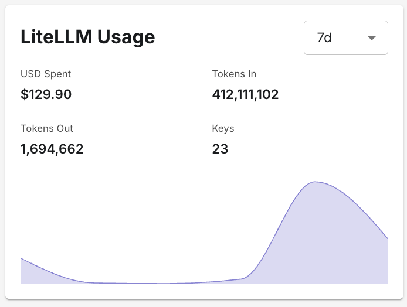
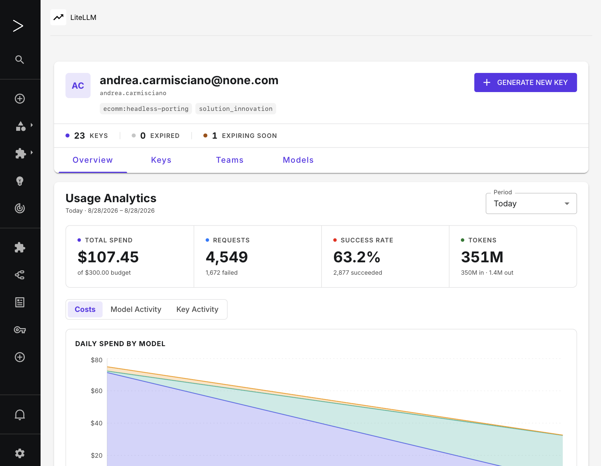
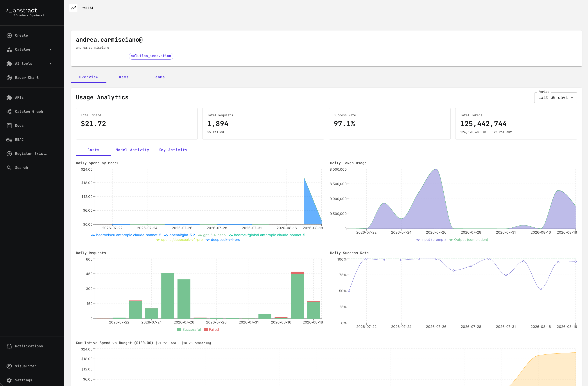
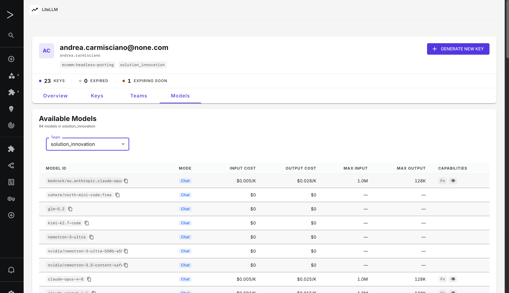
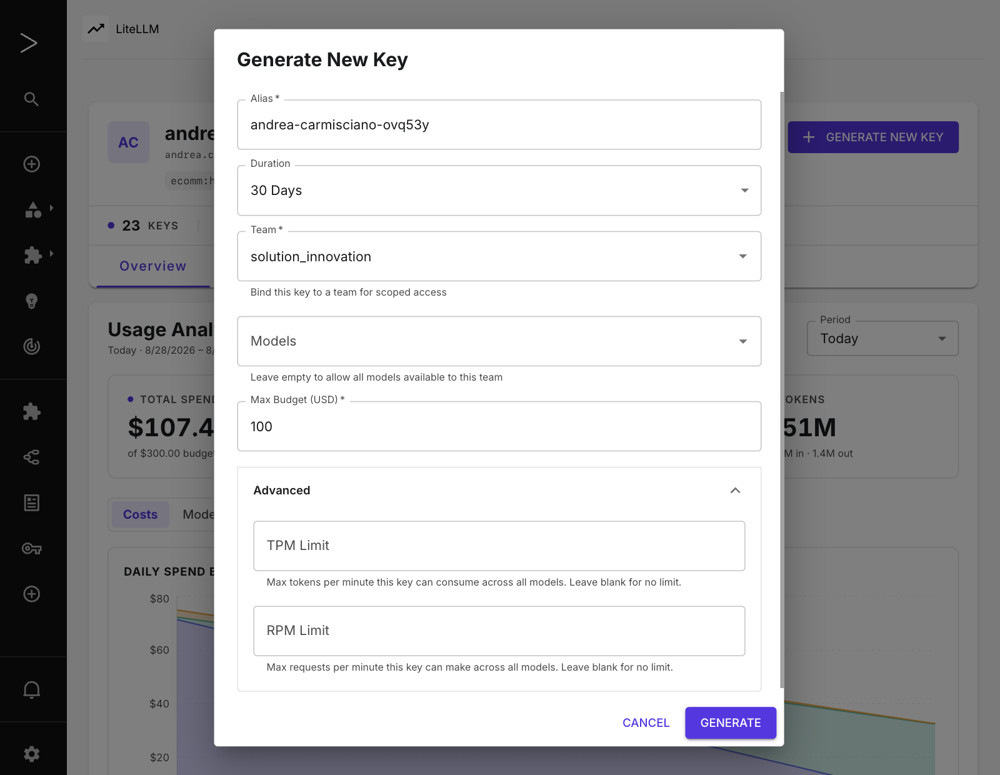
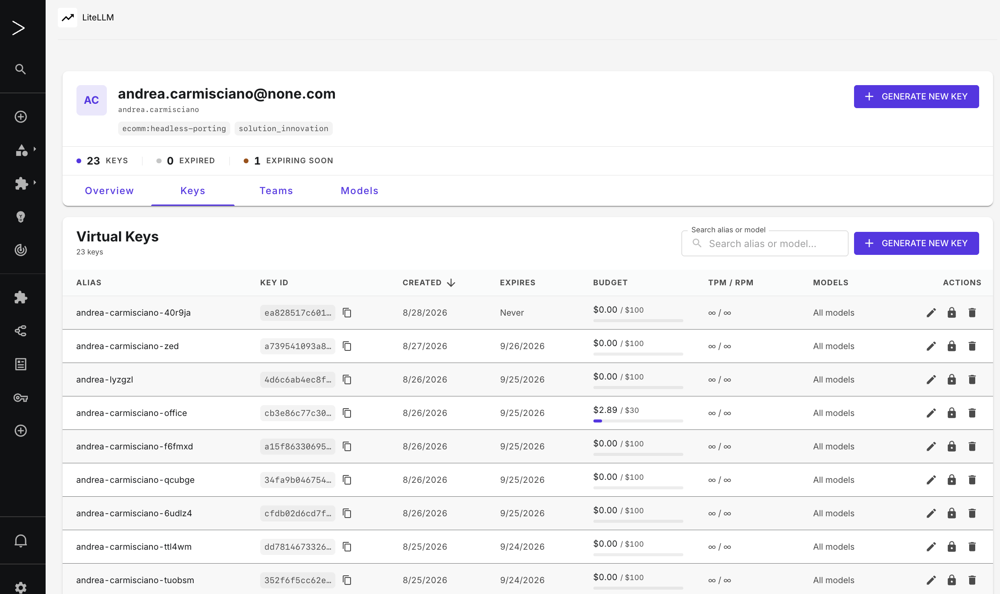
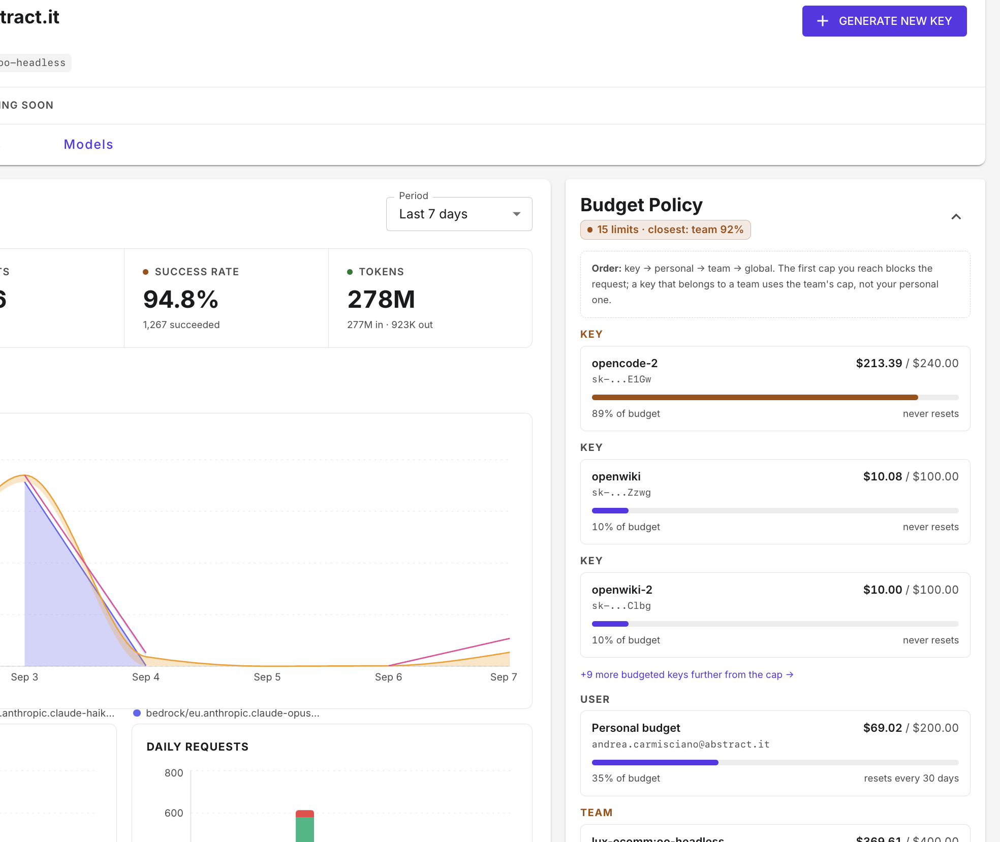
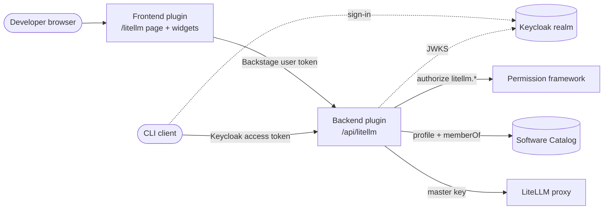

# Backstage LiteLLM Governance Plugin

Self-service access to your [LiteLLM](https://github.com/BerriAI/litellm) AI
gateway from Backstage, with the governance rules enforced on the server.

Developers create and manage their own LiteLLM virtual keys, see their spend
and budgets, and browse the models they may use — without anyone handing out
the LiteLLM master key. Platform teams decide budgets, models, key lifetimes
and who may manage teams, using Backstage identity, catalog groups and the
permission framework they already run.

- [Packages](#packages) · [Screenshots](#screenshots) · [Quick start](#quick-start) · [Adopting it in your organization](#adopting-it-in-your-organization)
- [Configuration](#configuration) · [Frontend components](#frontend-components) · [Permissions](#permissions) · [Team management](#team-management-litellm-team-admins)
- [Security model](#security-model) · [CLI bridge](#cli-bridge) · [Architecture](#architecture) · [API endpoints](#api-endpoints) · [Troubleshooting](#troubleshooting) · [Development](#development)

## Packages

| Package | npm | Role |
|---|---|---|
| `packages/plugin-litellm` | [`@acarmisc/backstage-plugin-litellm`](https://www.npmjs.com/package/@acarmisc/backstage-plugin-litellm) | Frontend plugin ([New Frontend System](https://backstage.io/docs/frontend-system/)): the `/litellm` page and homepage widgets |
| `packages/plugin-litellm-backend` | [`@acarmisc/backstage-plugin-litellm-backend`](https://www.npmjs.com/package/@acarmisc/backstage-plugin-litellm-backend) | Backend plugin ([New Backend System](https://backstage.io/docs/backend-system/)): talks to LiteLLM with the master key and enforces every rule |
| `packages/plugin-litellm-common` | [`@acarmisc/backstage-plugin-litellm-common`](https://www.npmjs.com/package/@acarmisc/backstage-plugin-litellm-common) | Shared permissions, request schemas and types (installed automatically as a dependency) |

Requirements: a Backstage app on the New Frontend System and New Backend
System (Backstage 1.50 or later), a reachable LiteLLM proxy with a database
(users, teams and keys live there) and its master key.

## Screenshots

### Home widget — at-a-glance usage on the Backstage homepage

The `LiteLLMHomeWidget` card surfaces the signed-in user's KPIs (USD spent, tokens in/out, active key count) alongside a daily-spend sparkline, with a `Today` / `7d` / `30d` period selector.



### Overview tab — usage analytics

The `Overview` tab is the default landing view. It shows the user's identity header (with team chips and key health counters), four KPI tiles (Total Spend, Total Requests, Success Rate, Total Tokens), and the `Costs` chart with per-model daily spend.



The full-page version below shows the complete chart grid (Daily Spend by Model, Daily Token Usage, Daily Requests, Daily Success Rate, Cumulative Spend vs Budget):



### Keys tab — virtual key inventory

Browse, edit, block, and revoke your virtual keys. Each row shows alias, key ID, creation/expiry dates, budget bar, TPM/RPM, and the models it can call.



### Generate New Key dialog

Mint a scoped key with its own budget, team binding, model list, and TPM/RPM caps. Failures (e.g. duplicate alias) surface inline with the upstream error.



### Models tab — available LLM models

Browse every model the proxy exposes, with per-model input/output cost and max input/output token limits. The team filter scopes the list to the team the key will be bound to.



### Budget Policy card

`LiteLLMBudgetWidget` in its `compact collapsible` form, as it appears beside the usage charts on the `/litellm` Overview tab: one spend-vs-cap meter for every limit the signed-in user has, grouped by level (`KEY`, `USER`, `TEAM`), with the order in which caps are enforced.



> Some screenshots predate the latest UI polish; the behaviour described in the text is current.

## Quick start

Run these from the root of your Backstage app.

**1. Install the packages**

```bash
yarn --cwd packages/backend add @acarmisc/backstage-plugin-litellm-backend
yarn --cwd packages/app add @acarmisc/backstage-plugin-litellm
```

**2. Register the backend plugin** in `packages/backend/src/index.ts`:

```ts
backend.add(import('@acarmisc/backstage-plugin-litellm-backend'));
```

**3. Register the frontend plugin.** If your app discovers features from its
dependencies (`app.packages: all` in `app-config.yaml`), there is nothing to do.
Otherwise add it to `createApp` in `packages/app/src/App.tsx`:

```tsx
import litellmPlugin from '@acarmisc/backstage-plugin-litellm';
// or: import { litellmPlugin } from '@acarmisc/backstage-plugin-litellm';

const app = createApp({
  features: [litellmPlugin /* , ...your other features */],
});
```

The plugin adds a page at `/litellm` and the
`liteLlmApiRef` API.

**4. Configure** `app-config.yaml` (the master key should come from a secret):

```yaml
litellm:
  baseUrl: http://litellm-proxy:4000          # internal URL the backend uses
  publicBaseUrl: https://llm.example.com      # URL developers use in snippets
  masterKey: ${LITELLM_MASTER_KEY}
  userIdDomain: example.com                   # user:default/jane.doe → jane.doe@example.com
  provisioning:
    enabled: true                             # create LiteLLM users on first visit
    defaults:
      maxBudget: 10
      budgetDuration: 30d
```

**5. Check it.** `GET /api/litellm/health` returns
`{ "status": "ok", "provisioning": true }`; then open `/litellm` while signed in.

## Adopting it in your organization

The plugin is safe to switch on with the defaults: users only ever act on
their own LiteLLM identity and keys, every limit is checked on the server, and
team management stays off until you enable it. The decisions below are what
you tailor to your organization.

### 1. Decide how Backstage users map to LiteLLM users

The LiteLLM `user_id` is the Backstage user entity name, plus `@<userIdDomain>`
when `litellm.userIdDomain` is set:

| Backstage entity | `userIdDomain` | LiteLLM `user_id` |
|---|---|---|
| `user:default/jane.doe` | `example.com` | `jane.doe@example.com` |
| `user:default/jane.doe` | — | `jane.doe` |
| `user:default/jane.doe@example.com` | (ignored) | `jane.doe@example.com` |

If LiteLLM already has users, pick the setting that reproduces their ids, or
existing keys and spend will not show up. The catalog `User` entity must exist
(it provides email, display name and group memberships).

### 2. Choose how users get into LiteLLM

- **Automatic provisioning** (`litellm.provisioning.enabled: true`): a LiteLLM
  user is created on the first visit, with `provisioning.defaults` (budget,
  reset window, models, teams, role). Use `provisioning.roles` to give catalog
  groups different defaults — for example a larger budget for an AI platform
  group. See [Autoprovisioning](#autoprovisioning).
- **Pre-created users** (the default): users must already exist in LiteLLM;
  others see a "not set up" message with `litellm.supportContact`.

### 3. Set the guard rails for self-service keys

| Setting | Default | What it controls |
|---|---|---|
| `litellm.keys.maxBudget` / `maxTpm` / `maxRpm` | `100` / `100000` / `1000` | Ceilings a user may request per key |
| `litellm.keys.allowedDurations` | `1d, 7d, 30d, 90d` | Key lifetimes on offer (keys never default to non-expiring) |
| `litellm.keyGeneration.teamRequired` | `true` | Every key must be bound to one of the user's teams |
| `litellm.keyGeneration.allowUnlimitedBudget` | `false` | Whether a key may have no budget |
| `litellm.keys.allowOwnerResetSpend` | `false` | Whether owners may reset their key's spend |

LiteLLM also enforces user and team budgets; the first cap a request reaches
blocks it.

### 4. Decide who may do what

Without a permission policy every `litellm.*` permission is allowed, which is
fine for "every employee may manage their own keys". Install a policy (for
example [`@backstage-community/plugin-rbac`](https://github.com/backstage/community-plugins/tree/main/workspaces/rbac))
when you need to restrict actions per role — see [Permissions](#permissions).
Two capabilities are group-gated in addition:

- **Audit log tab**: members of `litellm.audit.group`.
- **Team management**: members of `litellm.teamAdmin.group`, and only with
  `permission.enabled: true` — see [Team management](#team-management-litellm-team-admins).

### 5. Roll out

1. Deploy with provisioning on and conservative defaults to a pilot group.
2. Ask the LiteLLM admins to create the teams users should bind keys to (or
   enable [team management](#team-management-litellm-team-admins)), and list
   their ids in `provisioning.defaults.teams` / `provisioning.roles[].teams`.
3. Add the [homepage widgets](#frontend-components) so people find the page.
4. Optionally enable the [CLI bridge](#cli-bridge) for command-line clients.
5. Restrict access to the LiteLLM admin UI: it can change anything this plugin
   relies on (for example a team's `owning_group`).

The [interactive architecture diagram](docs/architecture/architecture.html)
walks through the main flows step by step.

## Configuration

### Environment Variables

Set these in your shell or deployment environment before starting Backstage. Backstage's config system supports `${ENV_VAR}` substitution in `app-config.yaml`:

```bash
LITELLM_BASE_URL=http://litellm-proxy:4000     # LiteLLM proxy URL
LITELLM_MASTER_KEY=sk-...                      # LiteLLM admin master key
```

### App Config Schema

Add to `app-config.yaml`. All keys live under the `litellm` top-level namespace:

```yaml
litellm:
  # Required — base URL of your LiteLLM proxy instance.
  # @visibility backend
  baseUrl: ${LITELLM_BASE_URL}

  # Optional — publicly reachable LiteLLM proxy URL, used to build
  # ready-to-paste curl / OpenAI-SDK snippets in the "Key Generated" dialog.
  # Served to the frontend via GET /config. When omitted the UI shows
  # "Endpoint not configured" — the internal baseUrl is never exposed.
  # publicBaseUrl: https://llm-gw.example.com

  # Required — LiteLLM master key for admin operations.
  # Never exposed to the frontend (marked @visibility secret).
  masterKey: ${LITELLM_MASTER_KEY}

  # Optional — email domain appended to the Backstage user entity name to form
  # the LiteLLM user_id. When set, a user entity "user:default/john.doe" maps
  # to "john.doe@example.com" in LiteLLM. Omit to use the bare entity name.
  # @visibility backend
  userIdDomain: example.com   # optional

  # Optional — autoprovisioning of LiteLLM users on first access.
  provisioning:
    # Whether to automatically create a LiteLLM user when the Backstage user
    # is not yet known to LiteLLM. Disabled by default.
    enabled: false   # default

    defaults:
      # Max lifetime spend (USD) before the account is blocked.
      maxBudget: 10          # default: 10

      # Spend-reset period after which the spend counter resets.
      # Accepts LiteLLM duration strings: "30d", "7d", "1h", etc.
      budgetDuration: 30d    # default: "30d"

      # LiteLLM model IDs the new user is allowed to call.
      # An empty list means all models configured in the proxy are allowed.
      models: []             # default: [] (all models)

      # LiteLLM team IDs to enrol the new user in automatically.
      teams: []              # default: [] (no teams)

      # LiteLLM role assigned to every provisioned user.
      # Valid values: proxy_admin, proxy_admin_viewer, internal_user,
      #               internal_user_viewer, team.
      userRole: internal_user   # default: "internal_user"

      # Tokens per minute hard cap (omit for no per-user limit).
      # tpmLimit: 100000

      # Requests per minute hard cap (omit for no per-user limit).
      # rpmLimit: 1000

      # Arbitrary key-value metadata stored on the LiteLLM user record.
      # metadata:
      #   cost_centre: engineering

    # Optional — role-based provisioning overrides.
    # Evaluated in order; first matching group wins.
    # Fields omitted here fall back to defaults above.
    roles:
      - group: group:default/ai-power-users   # Backstage group entity ref
        maxBudget: 100
        budgetDuration: 30d
        models:
          - gpt-4o
          - claude-3-5-sonnet
        userRole: internal_user

  # Optional — controls for the "Generate New Key" form in the frontend.
  keyGeneration:
    # Show the "Unlimited budget" checkbox. When false, a positive max
    # budget is always required.
    allowUnlimitedBudget: false   # default

    # Require a team to be selected before a key can be generated.
    # Set to false to allow personal, team-less keys.
    teamRequired: true   # default

  # Optional — hide real team budget dollars while still showing the level
  # of consumption (percent of cap, ok/near/over status, reset window).
  # The two flags are independent and enforced server-side (the backend
  # redacts max_budget/spend, including team usage spend so the budget
  # cannot be derived as spend / pct).
  display:
    # Hide dollars from regular team members (Teams cards, TEAM budget
    # meters, team daily-spend chart). Managers still see dollars unless
    # hideTeamBudgetForManagers is also set.
    hideTeamBudgetForMembers: false   # default

    # Hide dollars even from team managers (managed teams, write responses,
    # team usage). The ManageTeamDialog budget field becomes write-only:
    # blank keeps the current value, a new value overwrites it.
    hideTeamBudgetForManagers: false  # default

  # Optional — delegated team management (see "Team Management" below).
  # The whole feature is fail-closed: it stays dark unless `permission.enabled`
  # is true AND `group` is set. Every list below is an allowlist that starts
  # empty (nothing assignable) — you must populate it explicitly.
  teamAdmin:
    # REQUIRED to enable the feature. Backstage group whose members may manage
    # teams. The plugin ships an empty group at catalog/litellm-team-admins.yaml.
    group: group:default/litellm-team-admins

    # Models / access-groups a team admin may put on a team.
    allowedModels: [gpt-4o, claude-3-5-sonnet]   # default: []
    allowedModelAccessGroups: []                 # default: []

    # Hard USD ceiling a team admin may set as a team budget.
    maxBudgetCeiling: 500                         # default: unset (no budget settable)
    allowUnlimitedBudget: false                   # default: false

    # Allow DELETE /teams/:id (otherwise the route 403s — block the team in LiteLLM instead).
    allowTeamDelete: false                        # default: false

    # Refuse every team write, admins included (teams synced from an IdP).
    readOnly: false                               # default: false
    # When set, only members of one of these groups (on top of `group`) may create teams.
    createGroups: []                              # default: []
    # LiteLLM team roles that may add/remove members of their own team.
    memberManagerRoles: []                        # default: [] (off)

    # Knowledge-base (vector store) and MCP-server management. Highest-risk
    # surface — only enable with a real permission policy installed.
    objectPermissions:
      enabled: false                             # default: false
    allowedVectorStores: []                      # default: []  (vector store ids/names)
    allowedMcpServers: []                        # default: []  (MCP server ids/names)
    allowedMcpAccessGroups: []                   # default: []
```

**Config key reference:**

| Key | Type | Required | Default | Description |
|-----|------|----------|---------|-------------|
| `litellm.baseUrl` | string | yes | — | LiteLLM proxy base URL |
| `litellm.publicBaseUrl` | string | no | — | Publicly reachable proxy URL for snippet generation |
| `litellm.masterKey` | string | yes | — | Admin master key (`@visibility secret`) |
| `litellm.userIdDomain` | string | no | — | Email domain for LiteLLM user IDs |
| `litellm.provisioning.enabled` | boolean | no | `false` | Enable autoprovisioning |
| `litellm.provisioning.defaults.maxBudget` | number | no | `10` | Max spend (USD) per reset period |
| `litellm.provisioning.defaults.budgetDuration` | string | no | `"30d"` | Spend-reset period |
| `litellm.provisioning.defaults.models` | string[] | no | `[]` | Allowed model IDs (empty = all) |
| `litellm.provisioning.defaults.teams` | string[] | no | `[]` | Team IDs to join on creation |
| `litellm.provisioning.defaults.userRole` | string | no | `"internal_user"` | LiteLLM role |
| `litellm.provisioning.defaults.tpmLimit` | number | no | — | Tokens-per-minute cap |
| `litellm.provisioning.defaults.rpmLimit` | number | no | — | Requests-per-minute cap |
| `litellm.provisioning.defaults.metadata` | object | no | `{}` | Extra metadata on user record |
| `litellm.provisioning.roles[].group` | string | yes* | — | Backstage group entity ref |
| `litellm.provisioning.roles[].maxBudget` | number | no | — | Overrides default for group |
| `litellm.provisioning.roles[].budgetDuration` | string | no | — | Overrides default for group |
| `litellm.provisioning.roles[].models` | string[] | no | — | Overrides default for group |
| `litellm.provisioning.roles[].teams` | string[] | no | — | Overrides default for group |
| `litellm.provisioning.roles[].userRole` | string | no | — | Overrides default for group |
| `litellm.provisioning.roles[].tpmLimit` | number | no | — | Overrides default for group |
| `litellm.provisioning.roles[].rpmLimit` | number | no | — | Overrides default for group |
| `litellm.provisioning.roles[].metadata` | object | no | — | Merged over default metadata |
| `litellm.keyGeneration.allowUnlimitedBudget` | boolean | no | `false` | Show the "Unlimited budget" checkbox in the Generate New Key form |
| `litellm.keyGeneration.teamRequired` | boolean | no | `true` | Require a team to be selected before a key can be generated |
| `litellm.keys.maxBudget` | number | no | `100` | Server-side ceiling (USD) for a key's `max_budget` on generate/update |
| `litellm.keys.maxTpm` | number | no | `100000` | Server-side ceiling for a key's tokens-per-minute limit |
| `litellm.keys.maxRpm` | number | no | `1000` | Server-side ceiling for a key's requests-per-minute limit |
| `litellm.keys.allowedDurations` | string[] | no | `['1d','7d','30d','90d']` | Durations a key may be generated with (an empty list allows any `<n><s/m/h/d/w/y>`) |
| `litellm.keys.allowOwnerResetSpend` | boolean | no | `false` | Let key owners reset their own key's spend (still needs the `litellm.key.resetSpend` permission). Fails closed even under an allow-all policy |
| `litellm.cache.userInfoTtlSeconds` | number | no | `10` | TTL of the per-user LiteLLM profile cache (`0` disables) |
| `litellm.audit.group` | string | no | — | Backstage group whose members see the Audit Log tab and may call `/audit` and `/provisioning/preview` |
| `litellm.bridge.enabled` | boolean | no | `false` | Mount the [CLI bridge](#cli-bridge) routes |
| `litellm.bridge.issuer` | string | when bridge enabled | — | Keycloak realm issuer URL |
| `litellm.bridge.clientId` | string | no | `abby-cli` | OIDC client the CLI tokens must be issued for (`azp` / `aud`) |
| `litellm.bridge.allowedEmailDomains` | string[] | no | `[userIdDomain]` | Verified email domains allowed to use the bridge |
| `litellm.supportContact` | string | no | — | Who users should contact when their account isn't set up (shown in the UI) |
| `litellm.opencode.enabled` | boolean | no | `false` | Mount `/opencode/connect` (see [Security model](#security-model)) |
| `litellm.opencode.keyDuration` / `maxBudget` / `requireTeam` / `metadata` | — | no | `30d` / `50` / `false` / `{}` | Defaults for keys created through the OpenCode connect flow |
| `litellm.display.hideTeamBudgetForMembers` | boolean | no | `false` | Hide team budget dollars from members (percent + status still shown, enforced server-side) |
| `litellm.display.hideTeamBudgetForManagers` | boolean | no | `false` | Hide team budget dollars even from managers (budget field becomes write-only) |
| `litellm.teamAdmin.group` | string | no† | — | Backstage group whose members may manage teams. Setting this + `permission.enabled` enables the feature |
| `litellm.teamAdmin.allowedModels` | string[] | no | `[]` | Models a team admin may assign to a team |
| `litellm.teamAdmin.allowedModelAccessGroups` | string[] | no | `[]` | Model access-group names a team admin may assign |
| `litellm.teamAdmin.maxBudgetCeiling` | number | no | — | Hard USD ceiling for an admin-set team budget |
| `litellm.teamAdmin.allowUnlimitedBudget` | boolean | no | `false` | Let an admin create a team with no budget cap |
| `litellm.teamAdmin.allowTeamDelete` | boolean | no | `false` | Enable `DELETE /teams/:id` |
| `litellm.teamAdmin.readOnly` | boolean | no | `false` | Refuse every team write, admins included; reads keep working |
| `litellm.teamAdmin.createGroups` | string[] | no | `[]` | Narrow team creation to members of these groups (in addition to `group`) |
| `litellm.teamAdmin.memberManagerRoles` | string[] | no | `[]` | LiteLLM team roles (e.g. `admin`) allowed to add/remove members of their own team |
| `litellm.teamAdmin.objectPermissions.enabled` | boolean | no | `false` | Enable knowledge-base / MCP management routes |
| `litellm.teamAdmin.allowedVectorStores` | string[] | no | `[]` | Vector stores a team admin may attach as knowledge bases |
| `litellm.teamAdmin.allowedMcpServers` | string[] | no | `[]` | MCP servers a team admin may attach |
| `litellm.teamAdmin.allowedMcpAccessGroups` | string[] | no | `[]` | MCP access-group names a team admin may attach |

*required when the `roles` array is present
†required to enable team management

## Autoprovisioning

When `litellm.provisioning.enabled` is `true`, the backend automatically creates a LiteLLM user the first time a Backstage user hits any plugin endpoint (user info, keys, teams, or usage). The flow is:

1. The backend resolves the caller's Backstage identity from the request token (`user:default/<name>`).
2. It checks whether that identity already exists in LiteLLM via `/user/info`.
3. If not found, it looks up the user's Backstage catalog entity to fetch their profile (email, display name) and group memberships.
4. It applies any matching `provisioning.roles` override (first match wins), then calls `/user/new` on LiteLLM with the effective defaults.
5. A concurrent single-flight lock prevents duplicate `/user/new` calls when several endpoints fire in parallel on the same page load.

**Backstage catalog prerequisites:**

- The user **must exist as a `User` entity in the Backstage catalog**. The catalog is the source of truth for email, display name, and group memberships.
- Group memberships (used for role matching) are resolved from the `memberOf` relations on the user entity. These are typically populated by a catalog provider such as the LDAP, GitHub, or Microsoft Graph org provider.
- If `userIdDomain` is set, the entity name (e.g. `john.doe` from `user:default/john.doe`) is combined with the domain to produce the LiteLLM `user_id` (e.g. `john.doe@example.com`). Make sure LiteLLM users were created with matching IDs if you are migrating an existing deployment.
- If a user signs in without a catalog entity (e.g. `dangerouslyAllowSignInWithoutUserInCatalog` is set), provisioning still proceeds but the LiteLLM user record will lack email, display name, and team-role resolution — they will receive the default settings.

**Minimum working example with autoprovisioning enabled:**

```yaml
litellm:
  baseUrl: ${LITELLM_BASE_URL}
  masterKey: ${LITELLM_MASTER_KEY}
  provisioning:
    enabled: true
    defaults:
      maxBudget: 5
      budgetDuration: 30d
```

## Frontend components

All components show **the signed-in user's** data: identity is resolved by the
backend from the Backstage token, so none of them takes a user id. They all
need the backend plugin configured and the user present (or provisioned) in
LiteLLM.

| Component | Use it for |
|---|---|
| `LiteLLMPage` | The full page (mounted at `/litellm` by the plugin): Overview, Keys, Teams, Models, and Audit Log for members of `litellm.audit.group`. `?tab=keys` opens a tab, `?generate=1` opens the Generate New Key dialog |
| `LiteLLMHomeWidget` | Homepage card: spend, tokens and a daily sparkline |
| `LiteLLMBudgetWidget` | Homepage card explaining the budget hierarchy, with a meter per limit |
| `LiteLLMBudgetGauges` | Condensed budget card: one ring per enforcement level and a month-to-date chart |
| `GenerateKeyButton` | The shared "Generate New Key" button, for your own layouts (`onClick`, or `to="/litellm?generate=1"`) |
| `KeyFormDialog`, `ManageTeamDialog`, `DashboardHeader`, `KeysTable`, `UsageStats`, `TeamUsage` | Building blocks used by `LiteLLMPage`; prefer the page unless you need a custom layout |

> **Home page extensions.** Registering the widgets as `HomePageWidgetBlueprint` extensions (for `@backstage/plugin-home`'s customizable grid) is not shipped yet: `@backstage/plugin-home-react` currently pulls a second `@backstage/frontend-plugin-api` next to the plugin's, so it needs a Backstage dependency upgrade first. Until then, render the exported components in your homepage (use `bare` inside a card you already render).

### Home Widget

`LiteLLMHomeWidget` is a compact card you can drop onto any Backstage homepage. It shows **the signed-in user's** data — identity is resolved server-side from the Backstage Bearer token, so no `userId` prop is required and no additional backend endpoint is needed.

**What it shows:** one summary line — `$129.90 spent · 412M in · 1.7M out` — a daily-spend sparkline with a tooltip and a date-range caption (hidden when there is no daily data), and an `Open LiteLLM →` link resolved through the plugin's route ref. A period selector (`Today` / `7d` / `30d`) lives in the card header. While loading it shows skeletons in the final layout; if the account isn't set up it says so quietly instead of showing an error.

```tsx
import { LiteLLMHomeWidget } from '@acarmisc/backstage-plugin-litellm';

// In your HomePage composition:
<LiteLLMHomeWidget defaultPeriod="7d" />
```

**Props:**

| Prop | Type | Default | Description |
|------|------|---------|-------------|
| `defaultPeriod` | `'today' \| '7d' \| '30d'` | `'7d'` | Period shown on first render |
| `title` | `string` | `'LiteLLM Usage'` | Card title override |
| `bare` | `boolean` | `false` | Render without the card chrome and title, for hosts that already provide a titled card |

The widget requires the same backend setup as the full `LiteLLMPage` (backend plugin configured and the user provisioned in LiteLLM).

### Budget Policy Widget

`LiteLLMBudgetWidget` is a homepage-friendly card that explains **how LiteLLM enforces spend limits** and shows **where you stand** against each one. It renders the budget hierarchy as a numbered flow — Key → Personal → Team → Global — with a live meter on every limit the signed-in user has:

- **Key** — per-key cap, showing up to 3 keys closest to their budget (more budgeted keys are collapsed to a "+N" note).
- **User** — the personal budget on your account (with a note that team-bound keys skip it).
- **Team** — shared budgets for any team you belong to.
- **Global** — the proxy-wide cap, which is admin-configured and not visible from here.

Each meter shows spend vs. cap, the percent consumed, and the **reset window** (e.g. "resets every 30 days" vs. "never resets") when LiteLLM exposes it. Every variant carries a one-line **enforcement-order** note — `key → personal → team → global`, the first cap you reach blocks the request, and a team-bound key uses the team's cap instead of your personal one; the full variant also spells out that a reset window clears spend to $0 when it closes.

```tsx
import { LiteLLMBudgetWidget } from '@acarmisc/backstage-plugin-litellm';

// In your HomePage composition:
<LiteLLMBudgetWidget />

// Compressed, for a secondary column — folds under a one-line summary and
// shows only the limits you actually have, with a "create key" button
// pinned to the card:
<LiteLLMBudgetWidget compact collapsible action={<GenerateKeyButton size="small" onClick={openMyDialog} />} />
```

`compact` drops the numbered rail (but keeps the one-line `Order: key → personal → team → global` note), leaving a `KEY` / `USER` / `TEAM`-tagged meter list. `collapsible` folds it under a two-line header — the title, then a tone dot and a summary naming the closest limit's level (`3 limits · closest: team 95%`). `action` renders any node below a divider at the card bottom, kept visible when collapsed. The same widget (`compact collapsible`) also appears beside the usage charts on the `/litellm` Overview tab. The "+N more budgeted keys" note links to `/litellm?tab=keys` — `LiteLLMPage` reads `?tab=` to open a specific tab.

**Props:**

| Prop | Type | Default | Description |
|------|------|---------|-------------|
| `title` | `string` | `'Budget Policy'` | Card title override |
| `maxKeys` | `number` | `3` | Max key budgets to show (closest to the cap first) |
| `compact` | `boolean` | `false` | Drop the numbered rail; keep the one-line order note; show only the limits you have |
| `collapsible` | `boolean` | `false` | Fold the body under a clickable one-line summary header |
| `defaultExpanded` | `boolean` | `true` | Initial expanded state when `collapsible` |
| `action` | `ReactNode` | — | Node pinned below a divider at the card bottom (stays visible when collapsed) |

Like the home widget it needs the backend plugin configured and the user provisioned in LiteLLM.

### Budget Gauges (condensed homepage card)

When the full `LiteLLMBudgetWidget` takes too much vertical space — e.g. a homepage column beside other cards — `LiteLLMBudgetGauges` is the condensed form, built as **two spend KPIs on one line, one inline row per enforcement level** (`Key` · `User` · `Team`), and a full-width month-to-date spend strip.

**KPIs.** `Today spent`, with a `vs $9.10 yesterday` hint, and `Month to date`. Both come from the single month-to-date usage call the chart already makes, so the today indicator costs no extra request.

**Rows.** Each row carries the limit at that level **nearest its cap** across three fixed tracks: the ring (percentage in the centre — a limit past 100% keeps its real number instead of swapping the figure for a wide word, and a second line inside the ring would collide with the stroke), the level tag with the limit's name and one short note — `Over cap` in the tone colour, a `+N more` link, or the key id / email / team slug — and the right-aligned `$spend / $cap` in tabular figures over the reset window, so each fact is printed exactly once per row. Long names ellipsize inside a `minmax(0, 1fr)` track, so a key alias like `andrea-carmisciano-claude` can no longer stretch its column or push the neighbouring captions out of line. When a level holds several limits, the ring is the closest to its cap and the `+N more` link counts the rest through to the Keys tab; a level with no cap renders an empty ring with a short note, so the card keeps a stable shape.

**Chart.** Daily spend from the 1st of the current month through today (frozen period — no selector), with a dashed line at your cap when you have one; the caption line pairs `SPENT (MTD)` and the `Sep 1 – Sep 29`-style range with the month's total. Rings expose `role="meter"` with a descriptive label and announce `… — over cap` past 100%.

**Composable CTAs.** The bar under the card is assembled from a `ctas` list, so each host picks the actions it wants, in the order it wants:

| CTA kind | Default label | Behaviour |
|----------|---------------|-----------|
| `new-key` | `Generate New Key` | Shared `GenerateKeyButton` — identical copy, icon and styling to the plugin page. Calls `onCreateKey()` if supplied, else deep-links to `/litellm?generate=1`, which opens the generate-key dialog (`LiteLLMPage` honours the param) |
| `module` | `Open LiteLLM` | Links to the LiteLLM page (resolved from the plugin route ref, or `moduleHref`); hidden if the route isn't mounted |
| `all-limits` | `All limits` | Expands an in-place list of every limit you have (bounded height, scrolls); auto-hidden when you have no limits |

```tsx
import { LiteLLMBudgetGauges } from '@acarmisc/backstage-plugin-litellm';

// Defaults to ['module', 'all-limits']; `new-key` is added automatically
// (first) for users who have no keys yet, and never while loading or when the
// account isn't provisioned:
<LiteLLMBudgetGauges />

// Just jump into the module:
<LiteLLMBudgetGauges ctas={['module']} />

// Two CTAs, custom copy, and the full list visible on load:
<LiteLLMBudgetGauges
  ctas={[{ kind: 'new-key', label: 'Generate New Key' }, 'all-limits']}
  defaultExpanded
/>

// Own the new-key flow (e.g. open your own dialog):
<LiteLLMBudgetGauges
  ctas={['new-key']}
  onCreateKey={() => setMyDialogOpen(true)}
/>

// Escape hatch — any node below the CTAs:
<LiteLLMBudgetGauges action={<MyCustomFooter />} />
```

Passing `ctas={[]}` hides the bar; `action` still renders on its own. `expanded` / `defaultExpanded` / `onExpandedChange` give controlled or uncontrolled access to the all-limits view.

**Props:**

| Prop | Type | Default | Description |
|------|------|---------|-------------|
| `title` | `string` | `'Budget'` | Card title override |
| `bare` | `boolean` | `false` | Render without the card chrome and title, for hosts that already provide a titled card |
| `size` | `number` | `56` | Ring diameter in px (rings shrink further below the `sm` breakpoint) |
| `keysHref` | `string` | `` `${moduleHref}?tab=keys` `` | Where the `+N more` key link points |
| `moduleHref` | `string` | `'/litellm'` | Where the `module` CTA and `new-key` deep-link point |
| `onCreateKey` | `() => void` | — | Handle the `new-key` CTA yourself instead of deep-linking |
| `ctas` | `BudgetCta[]` | `['module', 'all-limits']` (`new-key` is prepended for users with no keys) | Action-bar buttons, in order |
| `maxExpandedKeys` | `number` | `8` | Max key limits listed in the expanded view |
| `expanded` | `boolean` | — | Controlled expanded state for the all-limits view |
| `defaultExpanded` | `boolean` | `false` | Initial expanded state when uncontrolled |
| `onExpandedChange` | `(expanded: boolean) => void` | — | Notified whenever the expanded state changes |
| `action` | `ReactNode` | — | Fully custom node pinned below the CTAs, below a divider |

Like the other widgets it needs the backend plugin configured and the user provisioned in LiteLLM.

## Permissions

The backend registers the following permissions with Backstage's
[permission framework](https://backstage.io/docs/permissions/overview).
Without a permission policy installed (e.g.
[`@backstage-community/plugin-rbac`](https://github.com/backstage/community-plugins/tree/main/workspaces/rbac)
or a custom `PermissionPolicy`), every request is allowed by default —
wiring these up only restricts behavior once you opt in.

| Permission | Guards | Notes |
|---|---|---|
| `litellm.key.create` | `POST /keys/generate` | |
| `litellm.key.revoke` | `DELETE /keys/:keyId`, `POST /keys/prune-expired` | |
| `litellm.key.manage` | `POST /keys/:keyId/update`, `/block` | |
| `litellm.key.resetSpend` | `POST /keys/:keyId/reset_spend` | Also needs `litellm.keys.allowOwnerResetSpend: true` — the flag is checked first and fails closed |
| `litellm.key.unblock` | `POST /keys/:keyId/unblock` | Required for **every** unblock (the caller must also own the key). Owners are not trusted to lift a block on their own say-so — grant this only to roles that may lift blocks; everyone else asks an administrator |
| `litellm.audit.read` | `GET /audit` | Additive to the existing `litellm.audit.group` check — both must pass |
| `litellm.team.create` | `POST /teams` | Team management — see [Team Management](#team-management-litellm-team-admins) |
| `litellm.team.manage` | `PATCH /teams/:id`, `GET /teams/managed` | |
| `litellm.team.members.manage` | `POST` / `DELETE /teams/:id/members` | |
| `litellm.team.knowledgebase.manage` | `GET /vector-stores`, `PUT /teams/:id/knowledge-bases` | Needs `litellm.teamAdmin.objectPermissions.enabled` |
| `litellm.team.mcp.manage` | `GET /mcp-servers`, `PUT /teams/:id/mcp-servers` | Needs `litellm.teamAdmin.objectPermissions.enabled` |
| `litellm.team.delete` | `DELETE /teams/:id` | Needs `litellm.teamAdmin.allowTeamDelete` |

All key-mutation routes still enforce the existing ownership guard (a caller
can only ever act on keys they own) regardless of permission policy. The
`litellm.team.*` routes are **fail-closed**: they return `403` unless the
permission framework is on (`permission.enabled: true`) *and*
`litellm.teamAdmin.group` is set *and* the caller is both a member of that
group and granted the permission — see [Team Management](#team-management-litellm-team-admins).

## Team Management (`litellm-team-admins`)

Lets a designated Backstage group create and run LiteLLM teams from the
**Teams** tab — set the team's models, budget, members, and (optionally)
knowledge bases and MCP servers — without holding the LiteLLM master key.

### How authorization works

Every `litellm.team.*` route runs **three** checks and all must pass:

1. **Feature gate** — `permission.enabled: true` *and* `litellm.teamAdmin.group`
   set. Missing either → the routes 403 and the UI controls are hidden.
2. **Group membership** — the caller is a member of `litellm.teamAdmin.group`
   (resolved from the catalog `memberOf` relations).
3. **Permission decision** — the permission policy `ALLOW`s the specific
   `litellm.team.*` permission. With no policy installed this defaults to
   `ALLOW`, which is why check 2 exists as a hard backstop.

On top of that, `PATCH` / `DELETE` / member / KB / MCP routes enforce an
**object guard**: the team's `metadata.owning_group` (stamped at creation)
must be a group the caller belongs to. Teams created outside this plugin have
no `owning_group` and are read-only here.

Server-side, an admin can only ever assign models in `allowedModels` /
`allowedModelAccessGroups`, a budget `≤ maxBudgetCeiling`, and knowledge
bases / MCP servers in the corresponding allowlists — anything else is a
`400`, never silently dropped.

### Delegating member management to a team role

`memberManagerRoles: [admin]` lets anyone holding that LiteLLM team role
(`members_with_roles[].role`) add and remove members of **their own** team
from the Teams tab, without being in `litellm.teamAdmin.group`. They get a
**Manage members** action that opens a members-only dialog; team settings stay
out of reach. Server-side, on this path:

- only the member routes are open — `PATCH` / `DELETE` of the team, KB and MCP
  still require the admin group;
- members are added with the `user` role, and `maxBudgetInTeam` is refused;
- a manager cannot remove themselves nor another member holding a manager role;
- the permission policy must still `ALLOW` `litellm.team.members.manage` for
  these users (with RBAC, bind it to a role they hold).

Audit events (`team.member.add` / `team.member.remove`) carry `via: group | teamRole`.

### Read-only mode (teams synced from an identity provider)

When teams and memberships are owned elsewhere — e.g. a reconciler that mirrors
Keycloak groups into LiteLLM — set `readOnly: true`. Every team write
(create, edit, delete, members, KB / MCP) returns `403` for everyone,
admins included, and the UI shows a *Synced from identity provider* badge
instead of the edit controls. Reads keep working, so allowlists and the rest
of the `teamAdmin` block can stay in place.

### Granting the capability with `@backstage-community/plugin-rbac`

1. Register the shipped group and point config at it:

   ```yaml
   permission:
     enabled: true
   litellm:
     teamAdmin:
       group: group:default/litellm-team-admins
       allowedModels: [gpt-4o]
       maxBudgetCeiling: 500
   ```

2. Grant the permissions to a role and bind the group to it. As a
   `permission.rbac.policies-csv-file`:

   ```csv
   p, role:default/litellm-team-admin, litellm.team.create, create, allow
   p, role:default/litellm-team-admin, litellm.team.manage, update, allow
   p, role:default/litellm-team-admin, litellm.team.members.manage, update, allow
   p, role:default/litellm-team-admin, litellm.team.knowledgebase.manage, update, allow
   p, role:default/litellm-team-admin, litellm.team.mcp.manage, update, allow
   p, role:default/litellm-team-admin, litellm.team.delete, delete, allow
   g, group:default/litellm-team-admins, role:default/litellm-team-admin
   ```

   Drop the `knowledgebase` / `mcp` / `delete` lines you don't want to delegate.

Without the RBAC plugin, the feature still works as a pure group gate (checks
1 + 2) — the same model the audit tab uses — but you cannot then scope
individual `litellm.team.*` permissions per role.

### Mapping a Keycloak group to the admin group

Team-admin membership is read from the **catalog**, so ingest the Keycloak
group with
[`@backstage/plugin-catalog-backend-module-keycloak`](https://backstage.io/docs/integrations/keycloak/) and
normalize its name with a `groupTransformer`:

```ts
keycloakBackendModule.setGroupTransformer(async (entity, group) => {
  if (group.name === 'litellm-team-admins') {
    entity.metadata.name = 'litellm-team-admins';
    entity.metadata.namespace = 'default';
  }
  return entity;
});
```

Then `litellm.teamAdmin.group: group:default/litellm-team-admins`. Membership
is managed entirely in Keycloak; the catalog sync propagates it. (An OIDC
`groups` token claim alone is **not** enough — the checks read catalog
relations, not token claims.)

### Security notes

- **Knowledge bases** expose their documents to every key in the team;
  **MCP servers** grant those keys tool execution through the model. Both are
  behind `litellm.teamAdmin.objectPermissions.enabled` (default off) and their
  own allowlists, and every attach/detach emits a
  `team.knowledgebase.set` / `team.mcp.set` audit event.
- `DELETE /teams/:id` is off by default (`allowTeamDelete`), refuses to remove
  a team referenced by `litellm.provisioning` config without `?force=true`,
  and is best avoided — block the team in LiteLLM instead (this plugin has no
  team block action).
- Team / member / access changes appear in the **Audit Log** tab under the
  `Team`, `Team member`, and `Team access (KB / MCP)` table filters.
- `metadata.owning_group` on teams is trusted by the authorization system and
  is editable by LiteLLM admins; guard access to the LiteLLM admin interface accordingly.

## Hiding team budgets (`litellm.display`)

When team budgets are finance-sensitive, `litellm.display` hides the real
dollar amounts while still showing the level of consumption. The two flags
are independent:

- `hideTeamBudgetForMembers` — members see `72% used` + `Over budget` /
  `Near limit` pills + reset window on Teams cards and TEAM budget meters;
  the `Budget` stat reads `Hidden` and the team daily-spend chart is omitted.
- `hideTeamBudgetForManagers` — same treatment on the manager surface
  (managed teams, team write responses, team usage). The ManageTeamDialog
  budget field becomes write-only: blank keeps the current value.

Enforcement is server-side: the backend strips `max_budget`/`spend` from
`GET /teams` (member flag) and `GET /teams/managed` plus team write
responses (manager flag), emits `budget_pct` / `budget_status` /
`budget_hidden` instead, and zeroes spend in `GET /teams/:id/usage` for
affected callers (otherwise `budget = spend / pct` would leak the cap).
Which usage flag applies depends on whether the caller belongs to the team's
`metadata.owning_group` (with team management enabled); catalog failures fail
closed to the member rule.
Unlimited teams (no budget) are never redacted — there are no dollars to
hide.

```yaml
litellm:
  display:
    hideTeamBudgetForMembers: true
    hideTeamBudgetForManagers: false
```

## Security model

Everything the UI enforces is also enforced by the backend — the server is the
source of truth.

**Who can call what**

- User routes (`/user/info`, `/keys*`, `/teams`, `/usage`, …) require a verified
  **Backstage user** credential. Service and external principals and anonymous
  callers get `401`. The LiteLLM identity is derived only from that credential;
  a `user_id` in the query string or body is never honoured.
- Every key mutation additionally checks that the caller owns the key.

**Key creation and editing** (`POST /keys/generate`, `POST /keys/:id/update`)

- Requests are parsed with a **strict** schema — unknown fields are rejected with
  `400` (for example `team_id`, `spend`, `blocked` or `user_id` on an update). The
  upstream LiteLLM request is built explicitly from the parsed fields, never by
  spreading the request body.
- `litellm.keys.maxBudget` / `maxTpm` / `maxRpm` / `allowedDurations` cap what a
  user can ask for; `litellm.keyGeneration.allowUnlimitedBudget` and `teamRequired`
  are enforced server-side; the `team_id` must be one of the caller's teams and
  the requested models must be within what the team (or, without a team, the
  user) may use.
- Server-owned metadata (`created_by_backstage_user`, `created_via`, …) always
  overrides anything the client sends.

**Sensitive actions**

- Resetting a key's spend needs `litellm.keys.allowOwnerResetSpend: true` **and**
  the `litellm.key.resetSpend` permission.
- Blocking records `metadata.blocked_by` / `blocked_at` for audit purposes only.
  Unblocking always needs `litellm.key.unblock` (plus ownership): the record is
  never used to decide who may lift a block, because an owner could influence it.
- `GET /teams/:teamId/usage` requires membership of the team, or membership of
  the team's `metadata.owning_group` (with team management enabled), and answers
  `404` otherwise, so team existence isn't leaked.
- Blocking an already-blocked key is a `409` and `blocked_by` / `blocked_at` (and
  `created_*` / `updated_*`) metadata can't be set by clients, so the audit
  record can't be overwritten or pre-seeded.
- A key generated without a duration gets `30d` (never a non-expiring key).

**Errors** never pass raw upstream text through: LiteLLM `401`/`403` become `502`
(so an upstream auth failure can't log the Backstage session out), upstream
`5xx` and network failures become a generic `502`, and `4xx` messages are stripped of
HTML and capped at 500 characters. `GET /config` exposes `publicBaseUrl` only,
never the internal `baseUrl`.

**OpenCode connect** (`litellm.opencode.enabled`): `GET /opencode/connect` only
renders a confirmation page. The state change happens on `POST`, which creates a
key or **rotates** the existing one via LiteLLM's key regeneration (falling back to
replacing the key on editions without it) and redirects
to the local `http://localhost:<port>/callback` with the new plaintext key —
never a stored hash. Note: the `POST` is not CSRF-token protected beyond the
localhost-only redirect target; the worst a forged request can do is rotate the
signed-in user's OpenCode key.

**Group membership** used for team administration and provisioning roles is
*direct* membership only — nested groups are not resolved.
`metadata.owning_group` on LiteLLM teams is trusted and editable by LiteLLM
admins, so guard the LiteLLM admin interface accordingly.

**Claude Code snippet**: the generated snippet no longer embeds a key in a helper
script; it reads the key from the OS keychain through `apiKeyHelper`.

## CLI bridge

The bridge lets command-line clients (for example the **Abby** CLI) list and
mint LiteLLM virtual keys **without ever holding the LiteLLM master key**. The
Backstage backend keeps the master key; the CLI authenticates with a Keycloak
access token from the same realm Backstage signs users in with.

Request flow for `/api/litellm/bridge/*`:

1. The CLI sends `Authorization: Bearer <keycloak-access-token>`.
2. The bridge verifies the JWT against the realm JWKS: issuer, client (`azp`,
   falling back to `aud`, must equal `litellm.bridge.clientId`) and token type
   (Keycloak's `typ` claim must be absent or `Bearer` — ID tokens are rejected).
   Failure → `401`, with details logged server-side only.
3. The caller needs a **verified email** (`email_verified: true`) in a trusted
   domain: `litellm.bridge.allowedEmailDomains`, defaulting to
   `litellm.userIdDomain`. With neither configured every caller gets `403`.
4. The LiteLLM user is **the same one the UI addresses**: the Keycloak
   `preferred_username` (the Backstage user entity name; an email-shaped
   username in a trusted domain is reduced to its local part) with
   `litellm.userIdDomain` applied. If no such user exists, a user with the
   token's email is reused; otherwise the user is provisioned from the token
   claims when `litellm.provisioning.enabled` (base defaults only — group role
   overrides need the catalog), or the call fails with `404`.
5. Keys go through **the same checks as the UI**: strict request schema,
   `litellm.keys.*` ceilings, `teamRequired`, team membership and allowed
   models. When unlimited budgets are not allowed and the CLI sends no
   `max_budget`, `provisioning.defaults.maxBudget` is used. Minted keys carry
   `created_via: abby-cli`, `created_by` and `created_at_iso` metadata.
   Backstage permissions are not evaluated: there is no Backstage credential to
   authorize.

Because the user id comes from `preferred_username`, make sure users cannot
edit their username in the Keycloak realm (the default).

| Endpoint | Method | Purpose |
|---|---|---|
| `/bridge/health` | GET | Bridge health and configured `clientId` (no auth) |
| `/bridge/user/info` | GET | Caller's `user_id`, team ids and team display names |
| `/bridge/keys` | GET | List the caller's keys |
| `/bridge/keys` | POST | Mint a key for the caller |
| `/bridge/models` | GET | Model catalogue; with `?team_id=` only that team's models (caller must belong to the team) |

Configuration:

```yaml
litellm:
  bridge:
    enabled: true                                   # default false
    issuer: https://auth.example.com/realms/acme    # required when enabled
    clientId: abby-cli                              # default abby-cli
    allowedEmailDomains: [example.com]              # default: [litellm.userIdDomain]
```

When `enabled` is true but `issuer` is missing, the backend logs an error at
startup and does not mount the bridge routes.

## Architecture


```mermaid
flowchart LR
  dev([Developer browser]) --> fe[Frontend plugin<br/>/litellm page + widgets]
  fe -->|Backstage user token| be[Backend plugin<br/>/api/litellm]
  cli([CLI client]) -->|Keycloak access token| be
  cli -. sign-in .-> kc[(Keycloak realm)]
  be -. JWKS .-> kc
  be -->|authorize litellm.*| perm[Permission framework]
  be -->|profile + memberOf| cat[(Software Catalog)]
  be -->|master key| llm[LiteLLM proxy]
```

The backend plugin is the only component that talks to LiteLLM, and the only
one holding the master key. It resolves the caller (a Backstage user, or a
Keycloak token on the bridge), applies the permission policy, group
memberships and configuration limits, and builds every LiteLLM request
explicitly.

- **Interactive diagram**: [`docs/architecture/architecture.html`](docs/architecture/architecture.html)
  — open it in a browser and play the flows step by step (UI key generation,
  first-visit provisioning, CLI bridge, team member management).
- **Written walkthrough**: [`docs/architecture/architecture.md`](docs/architecture/architecture.md).

## API Endpoints

The backend provides the following endpoints (all prefixed with `/api/litellm`).
A machine-readable OpenAPI 3.1 contract is served at `/api/litellm/openapi.json`
— point any OpenAPI-compatible renderer (Stoplight, Swagger UI, Redoc) at it
instead of maintaining this table by hand.

| Endpoint | Method | Purpose |
|----------|--------|---------|
| `/health` | GET | Health check |
| `/config` | GET | Public proxy URL (`null` when `publicBaseUrl` isn't set), key-generation and team-management flags, support contact |
| `/openapi.json` | GET | OpenAPI 3.1 contract for this backend surface |
| `/user/info` | GET | Get current user info and quotas |
| `/keys` | GET | List user's virtual keys |
| `/keys/generate` | POST | Generate a new virtual key |
| `/keys/prune-expired` | POST | Delete the caller's expired keys; returns `{ pruned, failed, failures? }` (`litellm.key.revoke`) |
| `/keys/:keyId` | DELETE | Revoke/delete a virtual key (caller must own it) |
| `/keys/:keyId/update` | POST | Update alias / models / budget / limits (caller must own it) |
| `/keys/:keyId/block` | POST | Suspend a key without revoking it (caller must own it) |
| `/keys/:keyId/unblock` | POST | Re-enable a blocked key (caller must own it) |
| `/keys/:keyId/reset_spend` | POST | Zero out a key's spend counter (caller must own it) |
| `/models` | GET | List available LLM models |
| `/teams` | GET | List teams the current user belongs to |
| `/teams/managed` | GET | List teams whose `owning_group` the caller administers (team-admin only) |
| `/teams` | POST | Create a team (`litellm.team.create`) |
| `/teams/:teamId` | PATCH | Update a team's alias / models / budget (`litellm.team.manage`) |
| `/teams/:teamId` | DELETE | Delete a team (`litellm.team.delete`, needs `allowTeamDelete`) |
| `/teams/:teamId/members` | POST / DELETE | Add / remove a team member (`litellm.team.members.manage`) |
| `/vector-stores` | GET | Allowlisted knowledge bases (`litellm.team.knowledgebase.manage`) |
| `/teams/:teamId/knowledge-bases` | PUT | Set a team's knowledge bases (`litellm.team.knowledgebase.manage`) |
| `/mcp-servers` | GET | Allowlisted MCP servers (`litellm.team.mcp.manage`) |
| `/teams/:teamId/mcp-servers` | PUT | Set a team's MCP servers (`litellm.team.mcp.manage`) |
| `/teams/:teamId/usage` | GET | Usage metrics for a team (`start_date`, `end_date` required) |
| `/usage` | GET | Get usage metrics and analytics for the current user |
| `/audit` | GET | Audit logs (gated by `litellm.audit.group` membership) |
| `/opencode/connect` | GET / POST | OpenCode SSO connect: GET shows a confirmation page (no state change); POST creates or rotates the key and redirects to the local callback (only when `litellm.opencode.enabled`) |
| `/provisioning/preview` | GET | Resolve which role a Backstage group maps to (dry-run, audit-group-gated) |

The UI endpoints above authenticate with the caller's Backstage token. The
`/bridge/*` endpoints authenticate with a Keycloak access token instead and are
listed under [CLI bridge](#cli-bridge).

## Troubleshooting

### "No team membership found in LiteLLM for this account."

This message is displayed in the Teams panel when the authenticated user exists in LiteLLM but belongs to no LiteLLM teams. It is an informational UI state, not an error — the user is provisioned and can still generate keys and view usage.

**Why it happens:**

- The user was provisioned with `provisioning.defaults.teams: []` (the default), so no teams were assigned at creation time.
- Alternatively the user was created manually in LiteLLM without team membership.

**How to fix:**

1. Add the user to a LiteLLM team via the LiteLLM admin UI or API.
2. Or set `litellm.provisioning.defaults.teams` (or a matching role override) to include the relevant LiteLLM team IDs before the user's first sign-in. Users already provisioned will not be retroactively re-assigned — update them via LiteLLM directly.

### "User not found in LiteLLM" (404 from the backend)

The backend returns a 404 with `{ "error": "User not found in LiteLLM", "hint": "...", "provisioning": false }` when:

- The user does not exist in LiteLLM, **and**
- `litellm.provisioning.enabled` is `false` (the default).

**Fix:** Either enable autoprovisioning (`litellm.provisioning.enabled: true`) or create the user manually in LiteLLM using an ID that matches the Backstage entity name (plus `userIdDomain` if configured).

### User identity is not resolving / user_id mismatch

The backend derives the LiteLLM `user_id` from the Backstage token using the formula:

```
user_id = <entity-name> [ + "@" + userIdDomain ]
```

For example, `user:default/john.doe` with `userIdDomain: example.com` produces `john.doe@example.com`. If LiteLLM has the user stored under a different ID (e.g. the full email was used as the entity name), the lookup will fail.

**Fix:** Align the LiteLLM user IDs with what the plugin derives, or adjust `userIdDomain`. If the Backstage entity name is already in email form (e.g. `user:default/john.doe@example.com`), do **not** set `userIdDomain` — the plugin detects the `@` and skips the domain suffix to avoid double-appending.

### Keys not visible

The Keys tab lists the keys LiteLLM associates with the caller's `user_id`.
Keys created in LiteLLM for another user id (for example before
`userIdDomain` was set) or without a `user_id` do not show up; check the
mapping in [Adopting it in your organization](#1-decide-how-backstage-users-map-to-litellm-users).

### Models list empty

Verify that `LITELLM_MASTER_KEY` has permissions to list models on the LiteLLM proxy.

### `502` errors ("LiteLLM is unavailable" / "LiteLLM rejected the request")

The backend could not reach LiteLLM, or LiteLLM refused the master key. The
real error is in the Backstage backend logs. `GET /api/litellm/health` only
confirms the plugin is mounted; it does not call LiteLLM.

### Usage not updating

Usage analytics refresh when the date range selector is changed. If data appears stale, change the range and change it back to trigger a reload.

## Development

### Build and test

The repo is an **npm workspace** with a single root `package-lock.json`. From the root:

```bash
npm ci --legacy-peer-deps   # Backstage's MUI4 theme has a react@^17 peer dep
npm run build               # builds the common package first, then backend + frontend
npm test                    # common, backend and frontend suites (node --test)
npm run lint
```

The root `package.json` pins `@yarnpkg/core` to `4.9.1` through `overrides`.
`4.9.2` was published with a `got` dependency that points at a patch file which
only exists in Yarn's own repository, and `@backstage/cli` (a devDependency here)
reaches it through `@backstage/cli-defaults`. Without the pin, resolving the tree
from scratch (for example after deleting `package-lock.json`) fails with no error
message. Drop the pin once a later `@yarnpkg/core` release is picked up by default.

Tests use Node's built-in runner (`node --test`). Frontend component tests run
against jsdom with Testing Library; `packages/plugin-litellm/src/testing/` holds
the DOM bootstrap and a MUI test theme, and `test-support/` holds the small Node
loader hooks that make Backstage's ESM builds importable outside a bundler.
`usePermission` caches decisions in a process-wide SWR cache, so tests that need
a different permission decision live in their own file (`*.denied.test.tsx`).

### API Reports

Public API surface for both packages is tracked with
[API Extractor](https://api-extractor.com/). After changing exports in
either package's `src/index.ts`, regenerate the report and commit the diff:

```bash
cd packages/plugin-litellm && npm run api-report
cd ../plugin-litellm-backend && npm run api-report
```

This isn't enforced in CI yet — treat a `report.api.md` diff as a review
signal for accidental breaking changes to the public API.

## Release

Each package is versioned and published on its own. Pushing a tag
`<package>@<version>` runs `.github/workflows/publish.yaml`, which checks that
the tag matches the version in that package's `package.json`, builds, publishes
to npm with provenance and creates a GitHub Release.

| Tag prefix | Package |
|---|---|
| `litellm-common@` | `@acarmisc/backstage-plugin-litellm-common` |
| `litellm-backend@` | `@acarmisc/backstage-plugin-litellm-backend` |
| `litellm@` | `@acarmisc/backstage-plugin-litellm` |

```bash
# 1. Bump "version" in the package.json files and add CHANGELOG entries, then:
git commit -am "chore: release ..."
git push origin main

# 2. Tag. Publish common first when it changed: the other two pin it exactly.
git tag litellm-backend@X.Y.Z && git push origin litellm-backend@X.Y.Z
git tag litellm@X.Y.Z         && git push origin litellm@X.Y.Z
```
