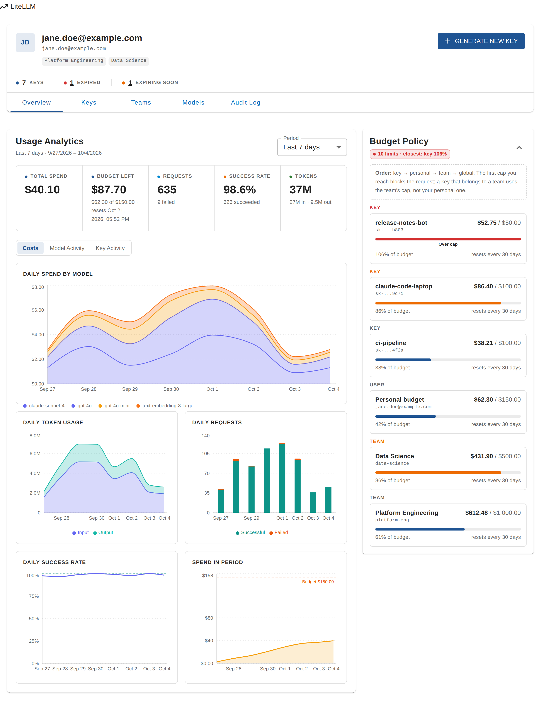
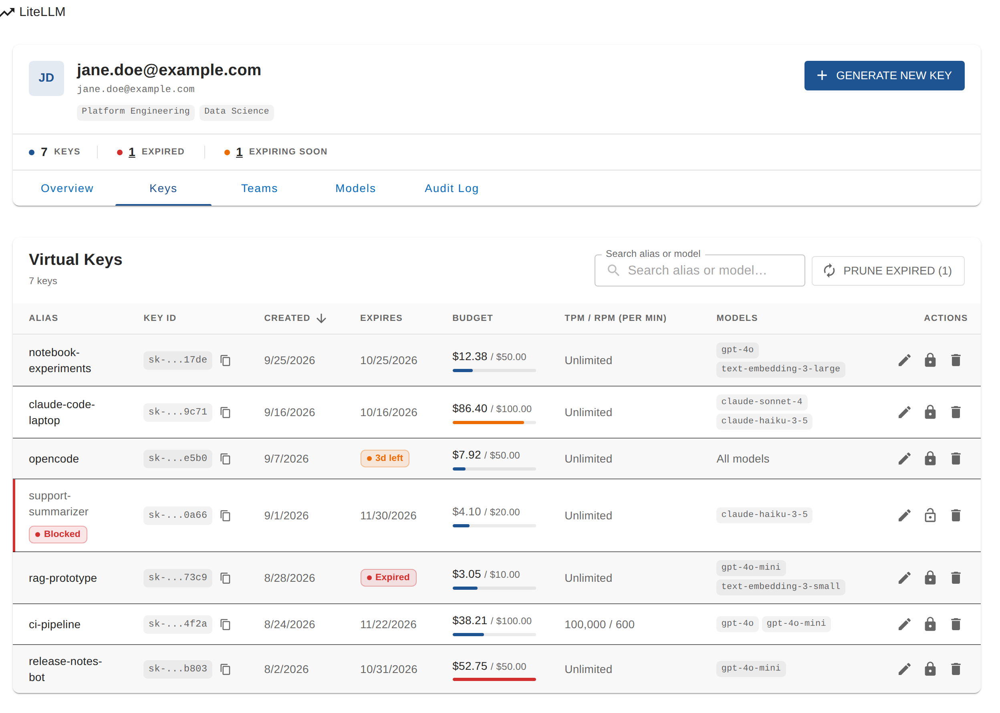
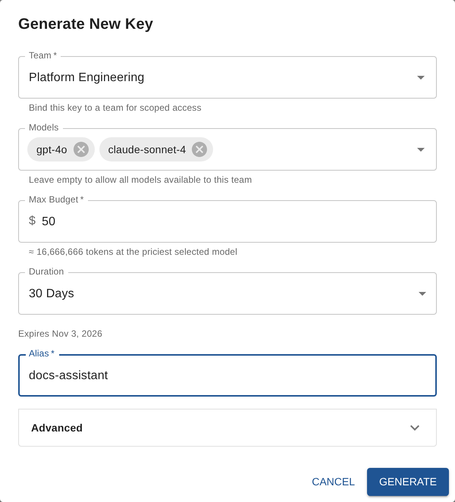
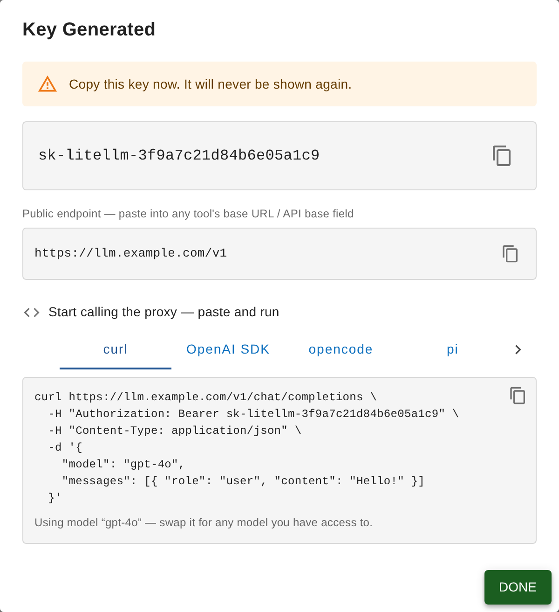
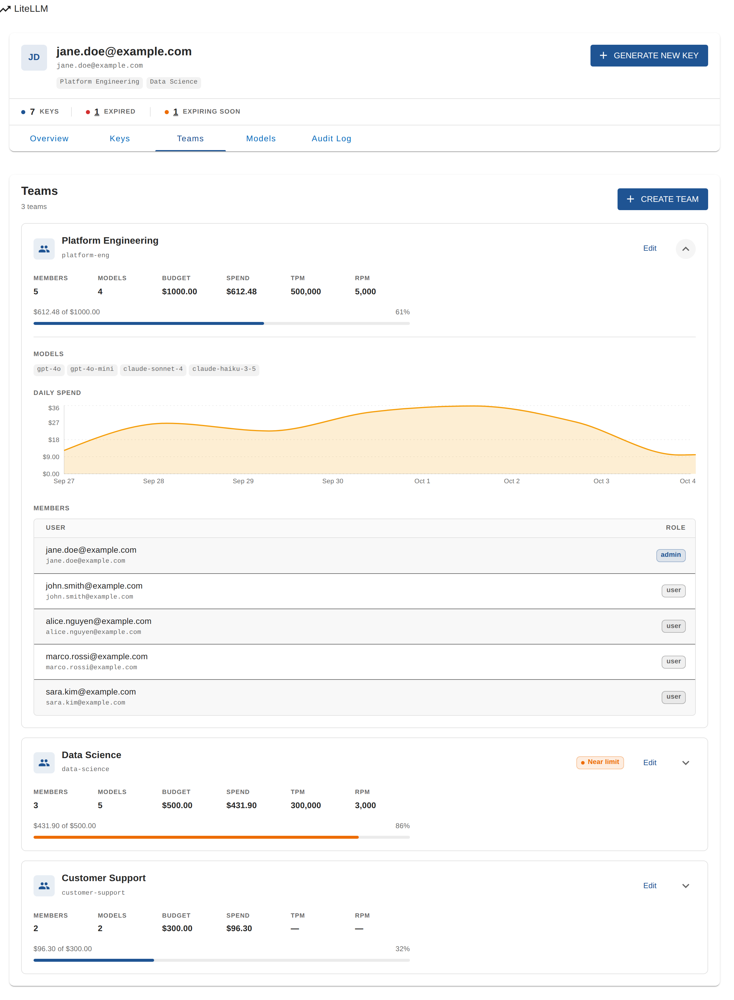
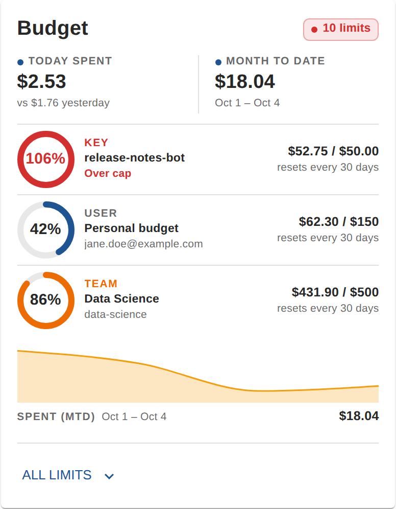
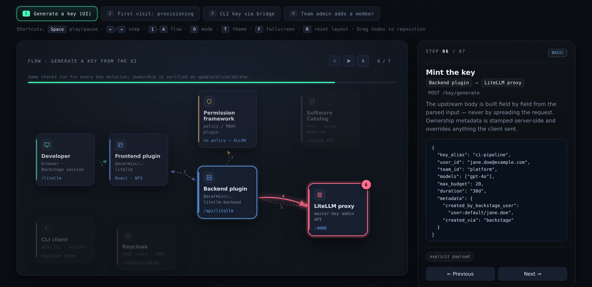

# LiteLLM Governance for Backstage

[](https://www.npmjs.com/package/@acarmisc/backstage-plugin-litellm)
[](https://www.npmjs.com/package/@acarmisc/backstage-plugin-litellm-backend)
[](https://github.com/acarmisc/backstage-plugin-litellm-govai/actions/workflows/ci.yaml)
[](LICENSE)

Self-service access to your [LiteLLM](https://github.com/BerriAI/litellm) AI
gateway from Backstage, with the rules enforced on the server.

Developers create their own virtual keys, see what they spend and which models
they may use, without anyone handing out the LiteLLM master key. Platform teams
set budgets, models and key lifetimes, and decide who manages teams, with the
Backstage identity, catalog groups and permissions they already run.

- **Keys** — generate, edit, block and revoke scoped keys, with ready-to-paste
  snippets for curl, the OpenAI SDK, opencode and Claude Code.
- **Usage and budgets** — spend, tokens and requests per model and per key;
  every budget that applies (key, personal, team) and how close it is.
- **Teams** — team budgets and usage for members; delegated team administration
  (models, budget, members, knowledge bases, MCP servers) for an admin group.
- **Guard rails** — key ceilings, allowed durations, team and model checks,
  ownership checks and Backstage permissions, all enforced by the backend.
- **Provisioning** — LiteLLM users created on first visit, with per-group
  defaults.
- **Homepage cards**, an **audit log** and a **CLI bridge** for command-line
  clients.

| Overview | Keys |
| --- | --- |
|  |  |
| **Generate a key** | **Use it right away** |
|  |  |
| **Teams** | **Homepage card** |
|  |  |

More screens in [docs/frontend.md](docs/frontend.md).

## How it works



The frontend only talks to the backend plugin. The backend is the only
component holding the LiteLLM master key: it resolves the caller's Backstage
identity, applies permissions, group memberships and configured limits, and
builds every LiteLLM request field by field. Step through the main flows in
the [interactive diagram](docs/architecture.html) or read
[docs/architecture.md](docs/architecture.md).

## Packages

| Package | What it does |
| --- | --- |
| [`@acarmisc/backstage-plugin-litellm`](packages/plugin-litellm) | Frontend: `/litellm` page, dialogs, homepage cards |
| [`@acarmisc/backstage-plugin-litellm-backend`](packages/plugin-litellm-backend) | Backend: routes, LiteLLM client, provisioning, permissions, CLI bridge |
| [`@acarmisc/backstage-plugin-litellm-common`](packages/plugin-litellm-common) | Permissions, request schemas and shared types |

## Requirements

- Backstage 1.50 or later, on the
  [new frontend system](https://backstage.io/docs/frontend-system/) and the
  [new backend system](https://backstage.io/docs/backend-system/).
- A LiteLLM proxy with its database (users, teams and keys live there) and its
  master key.
- Users in the Backstage catalog (they provide email, display name and group
  memberships).

## Getting started

1. Install the packages:

   ```bash
   yarn --cwd packages/backend add @acarmisc/backstage-plugin-litellm-backend
   yarn --cwd packages/app add @acarmisc/backstage-plugin-litellm
   ```

2. Register the backend in `packages/backend/src/index.ts`:

   ```ts
   backend.add(import('@acarmisc/backstage-plugin-litellm-backend'));
   ```

3. If your app doesn't discover features automatically (`app.packages: all`),
   add the frontend plugin to `createApp`:

   ```ts
   import litellmPlugin from '@acarmisc/backstage-plugin-litellm';

   export default createApp({ features: [litellmPlugin] });
   ```

4. Point the backend at LiteLLM:

   ```yaml
   # app-config.yaml
   litellm:
     baseUrl: http://litellm-proxy:4000        # internal URL used by the backend
     publicBaseUrl: https://llm.example.com    # URL shown to users in snippets
     masterKey: ${LITELLM_MASTER_KEY}
     userIdDomain: example.com                 # user:default/jane.doe -> jane.doe@example.com
     provisioning:
       enabled: true                           # create LiteLLM users on first visit
   ```

5. Open `/litellm`. `GET /api/litellm/health` answers `{"status":"ok"}` once
   the backend is mounted.

Rolling it out to a company? [docs/adoption.md](docs/adoption.md) walks
through identity mapping, provisioning, key limits, permissions and a rollout
checklist.

## Configuration at a glance

| Key | Default | Purpose |
| --- | --- | --- |
| `litellm.baseUrl`, `masterKey` | — | LiteLLM proxy and its master key (required) |
| `litellm.publicBaseUrl` | — | Proxy URL shown in snippets; the internal URL is never sent to browsers |
| `litellm.userIdDomain` | — | Suffix that turns a Backstage user name into the LiteLLM `user_id` |
| `litellm.provisioning.*` | off | Create LiteLLM users on first visit, with defaults and per-group overrides |
| `litellm.keys.*` | `$100`, `1d/7d/30d/90d` | Ceilings for key budget, TPM, RPM and allowed durations |
| `litellm.keyGeneration.teamRequired` | `true` | Every key must be bound to one of the user's teams |
| `litellm.audit.group` | — | Group that sees the Audit Log tab |
| `litellm.teamAdmin.*` | off | Delegated team management (needs `permission.enabled`) |
| `litellm.display.*` | off | Hide team budget dollars from members or managers |
| `litellm.bridge.*` | off | CLI bridge with Keycloak access tokens |

Every key, with defaults and examples: [docs/configuration.md](docs/configuration.md).

## Permissions

The backend registers `litellm.*` permissions. Without a permission policy
they are all allowed; with one (for example the RBAC plugin) you decide per
role. Ownership checks, configured limits and the team-admin group always
apply.

| Permission | Guards |
| --- | --- |
| `litellm.key.create` / `revoke` / `manage` | Create, delete, update and block keys |
| `litellm.key.resetSpend` / `unblock` | Reset spend (also needs `litellm.keys.allowOwnerResetSpend`), unblock |
| `litellm.audit.read` | Audit log (also needs `litellm.audit.group`) |
| `litellm.team.create` / `manage` / `members.manage` / `delete` | Team administration |
| `litellm.team.knowledgebase.manage` / `mcp.manage` | Knowledge bases and MCP servers on teams |

Details, RBAC policy examples and team management:
[docs/permissions.md](docs/permissions.md).

## Documentation

| Page | Read it for |
| --- | --- |
| [Adoption guide](docs/adoption.md) | Decisions and rollout checklist for an organization |
| [Configuration](docs/configuration.md) | Every `litellm.*` key, autoprovisioning |
| [Frontend](docs/frontend.md) | The page, dialogs and homepage cards, with their props |
| [Permissions and team management](docs/permissions.md) | Permissions, team admins, RBAC, budget hiding |
| [CLI bridge](docs/cli-bridge.md) | Keys for command-line clients via Keycloak tokens |
| [Backend API](docs/api.md) | REST endpoints (an OpenAPI document is served at `/api/litellm/openapi.json`) |
| [Architecture](docs/architecture.md) | Components and request flows ([interactive](docs/architecture.html)) |
| [Troubleshooting](docs/troubleshooting.md) | Common errors and their causes |
| [Security](SECURITY.md) | Security model and how to report a vulnerability |
| [Contributing](CONTRIBUTING.md) | Build, test, mock dev instance, screenshots, releases |

## Development

```bash
npm ci --legacy-peer-deps
npm run build && npm run lint && npm test
cd packages/plugin-litellm && npm start    # the UI with mock data, no backend needed
```

See [CONTRIBUTING.md](CONTRIBUTING.md).

## License

[Apache-2.0](LICENSE)
