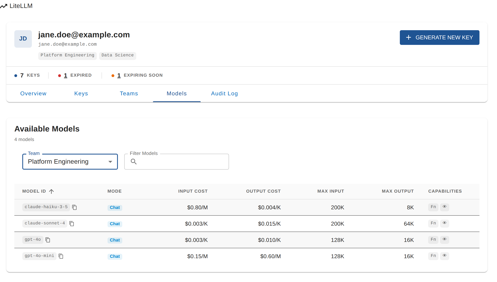
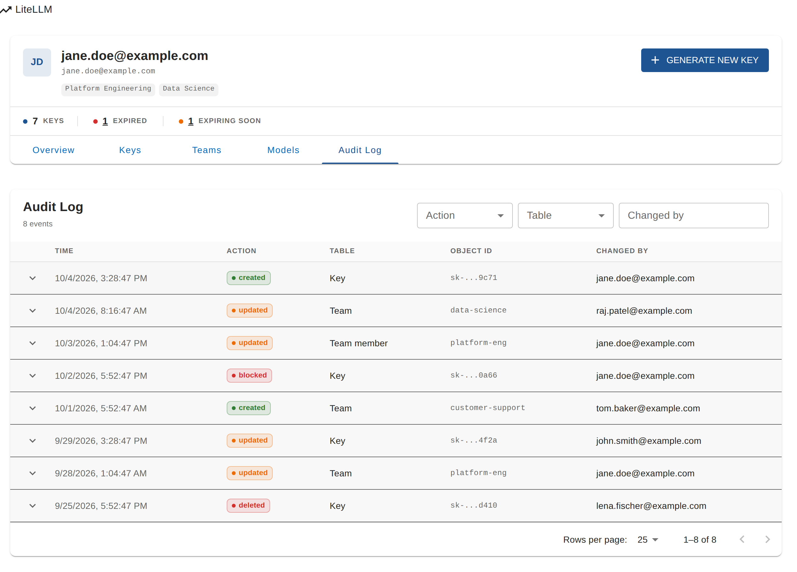
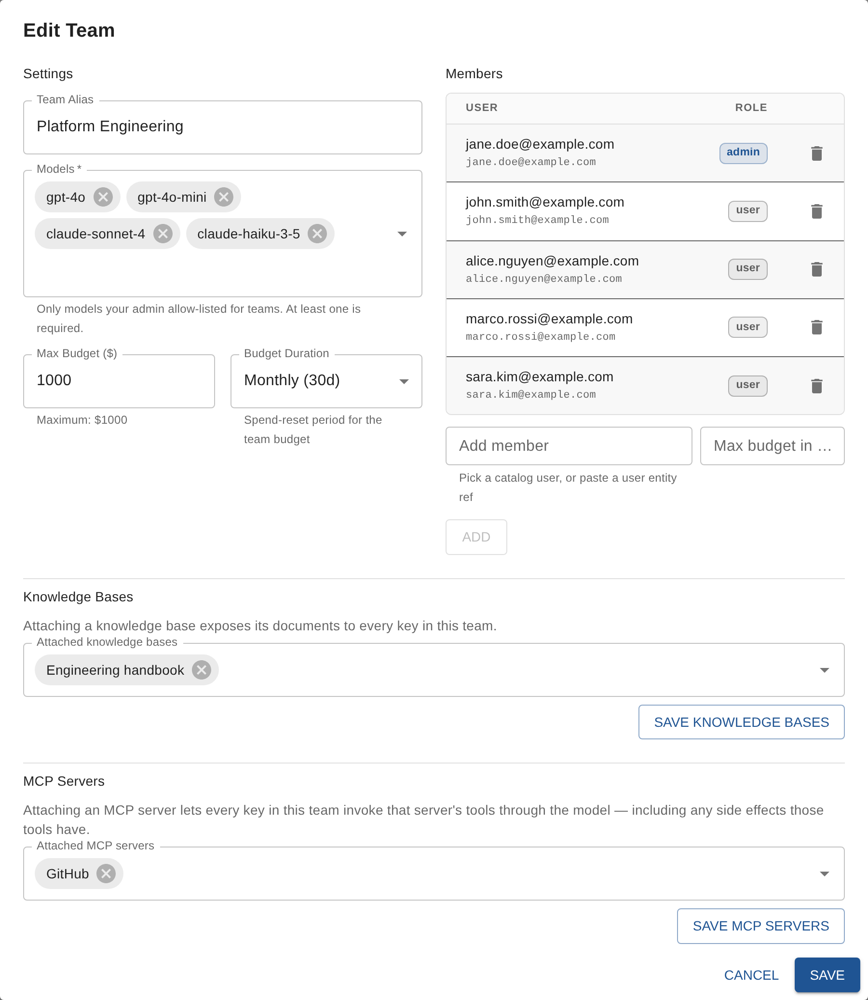
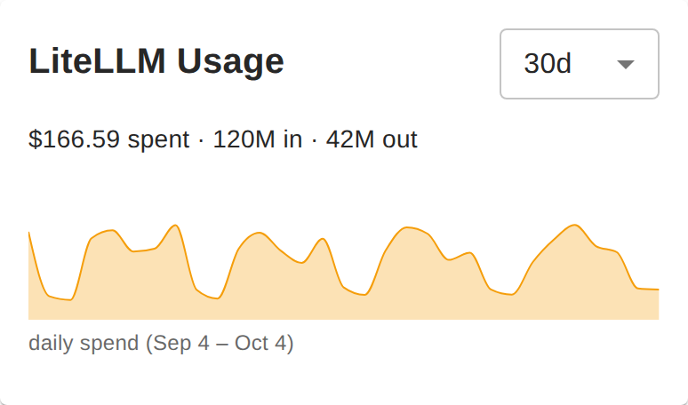
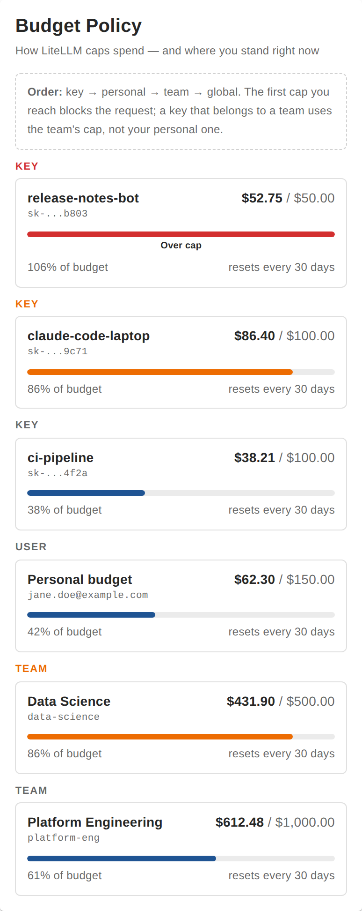

# Frontend components

All components show **the signed-in user's** data: identity is resolved by the
backend from the Backstage token, so none of them takes a user id. They all
need the backend plugin configured and the user present (or provisioned) in
LiteLLM.

| Component | Use it for |
|---|---|
| `LiteLLMPage` | The full page (mounted at `/litellm` by the plugin): Overview, Keys, Teams, Models, and Audit Log for members of `litellm.audit.group`. `?tab=keys` opens a tab, `?generate=1` opens the Generate New Key dialog |
| `LiteLLMHomeWidget` | Homepage card: spend, tokens and a daily sparkline |
| `LiteLLMBudgetWidget` | Homepage card explaining the budget hierarchy, with a meter per limit |
| `LiteLLMBudgetGauges` | Condensed budget card: one ring per enforcement level and a month-to-date chart |
| `GenerateKeyButton` | The shared "Generate New Key" button, for your own layouts (`onClick`, or `to="/litellm?generate=1"`) |
| `KeyFormDialog`, `ManageTeamDialog`, `DashboardHeader`, `KeysTable`, `UsageStats`, `TeamUsage` | Building blocks used by `LiteLLMPage`; prefer the page unless you need a custom layout |

> **Home page extensions.** Registering the widgets as `HomePageWidgetBlueprint` extensions (for `@backstage/plugin-home`'s customizable grid) is not shipped yet: `@backstage/plugin-home-react` currently pulls a second `@backstage/frontend-plugin-api` next to the plugin's, so it needs a Backstage dependency upgrade first. Until then, render the exported components in your homepage (use `bare` inside a card you already render).

## The `/litellm` page

| Overview | Keys |
| --- | --- |
|  |  |
| **Teams** | **Models** |
|  |  |

The **Audit Log** tab appears for members of `litellm.audit.group`:



### Dialogs

| Generate New Key | Key generated |
| --- | --- |
|  |  |

Team admins edit a team's models, budget, members, knowledge bases and MCP
servers in one dialog:



## Homepage cards

### `LiteLLMHomeWidget`



`LiteLLMHomeWidget` is a compact card you can drop onto any Backstage homepage. It shows **the signed-in user's** data — identity is resolved server-side from the Backstage Bearer token, so no `userId` prop is required and no additional backend endpoint is needed.

**What it shows:** one summary line — `$129.90 spent · 412M in · 1.7M out` — a daily-spend sparkline with a tooltip and a date-range caption (hidden when there is no daily data), and an `Open LiteLLM →` link resolved through the plugin's route ref. A period selector (`Today` / `7d` / `30d`) lives in the card header. While loading it shows skeletons in the final layout; if the account isn't set up it says so quietly instead of showing an error.

```tsx
import { LiteLLMHomeWidget } from '@acarmisc/backstage-plugin-litellm';

// In your HomePage composition:
<LiteLLMHomeWidget defaultPeriod="7d" />
```

**Props:**

| Prop | Type | Default | Description |
|------|------|---------|-------------|
| `defaultPeriod` | `'today' \| '7d' \| '30d'` | `'7d'` | Period shown on first render |
| `title` | `string` | `'LiteLLM Usage'` | Card title override |
| `bare` | `boolean` | `false` | Render without the card chrome and title, for hosts that already provide a titled card |

The widget requires the same backend setup as the full `LiteLLMPage` (backend plugin configured and the user provisioned in LiteLLM).

### `LiteLLMBudgetWidget`



`LiteLLMBudgetWidget` is a homepage-friendly card that explains **how LiteLLM enforces spend limits** and shows **where you stand** against each one. It renders the budget hierarchy as a numbered flow — Key → Personal → Team → Global — with a live meter on every limit the signed-in user has:

- **Key** — per-key cap, showing up to 3 keys closest to their budget (more budgeted keys are collapsed to a "+N" note).
- **User** — the personal budget on your account (with a note that team-bound keys skip it).
- **Team** — shared budgets for any team you belong to.
- **Global** — the proxy-wide cap, which is admin-configured and not visible from here.

Each meter shows spend vs. cap, the percent consumed, and the **reset window** (e.g. "resets every 30 days" vs. "never resets") when LiteLLM exposes it. Every variant carries a one-line **enforcement-order** note — `key → personal → team → global`, the first cap you reach blocks the request, and a team-bound key uses the team's cap instead of your personal one; the full variant also spells out that a reset window clears spend to $0 when it closes.

```tsx
import { LiteLLMBudgetWidget } from '@acarmisc/backstage-plugin-litellm';

// In your HomePage composition:
<LiteLLMBudgetWidget />

// Compressed, for a secondary column — folds under a one-line summary and
// shows only the limits you actually have, with a "create key" button
// pinned to the card:
<LiteLLMBudgetWidget compact collapsible action={<GenerateKeyButton size="small" onClick={openMyDialog} />} />
```

`compact` drops the numbered rail (but keeps the one-line `Order: key → personal → team → global` note), leaving a `KEY` / `USER` / `TEAM`-tagged meter list. `collapsible` folds it under a two-line header — the title, then a tone dot and a summary naming the closest limit's level (`3 limits · closest: team 95%`). `action` renders any node below a divider at the card bottom, kept visible when collapsed. The same widget (`compact collapsible`) also appears beside the usage charts on the `/litellm` Overview tab. The "+N more budgeted keys" note links to `/litellm?tab=keys` — `LiteLLMPage` reads `?tab=` to open a specific tab.

**Props:**

| Prop | Type | Default | Description |
|------|------|---------|-------------|
| `title` | `string` | `'Budget Policy'` | Card title override |
| `maxKeys` | `number` | `3` | Max key budgets to show (closest to the cap first) |
| `compact` | `boolean` | `false` | Drop the numbered rail; keep the one-line order note; show only the limits you have |
| `collapsible` | `boolean` | `false` | Fold the body under a clickable one-line summary header |
| `defaultExpanded` | `boolean` | `true` | Initial expanded state when `collapsible` |
| `action` | `ReactNode` | — | Node pinned below a divider at the card bottom (stays visible when collapsed) |

Like the home widget it needs the backend plugin configured and the user provisioned in LiteLLM.

### `LiteLLMBudgetGauges`


When the full `LiteLLMBudgetWidget` takes too much vertical space — e.g. a homepage column beside other cards — `LiteLLMBudgetGauges` is the condensed form, built as **two spend KPIs on one line, one inline row per enforcement level** (`Key` · `User` · `Team`), and a full-width month-to-date spend strip.

**KPIs.** `Today spent`, with a `vs $9.10 yesterday` hint, and `Month to date`. Both come from the single month-to-date usage call the chart already makes, so the today indicator costs no extra request.

**Rows.** Each row carries the limit at that level **nearest its cap** across three fixed tracks: the ring (percentage in the centre — a limit past 100% keeps its real number instead of swapping the figure for a wide word, and a second line inside the ring would collide with the stroke), the level tag with the limit's name and one short note — `Over cap` in the tone colour, a `+N more` link, or the key id / email / team slug — and the right-aligned `$spend / $cap` in tabular figures over the reset window, so each fact is printed exactly once per row. Long names ellipsize inside a `minmax(0, 1fr)` track, so a key alias like `andrea-carmisciano-claude` can no longer stretch its column or push the neighbouring captions out of line. When a level holds several limits, the ring is the closest to its cap and the `+N more` link counts the rest through to the Keys tab; a level with no cap renders an empty ring with a short note, so the card keeps a stable shape.

**Chart.** Daily spend from the 1st of the current month through today (frozen period — no selector), with a dashed line at your cap when you have one; the caption line pairs `SPENT (MTD)` and the `Sep 1 – Sep 29`-style range with the month's total. Rings expose `role="meter"` with a descriptive label and announce `… — over cap` past 100%.

**Composable CTAs.** The bar under the card is assembled from a `ctas` list, so each host picks the actions it wants, in the order it wants:

| CTA kind | Default label | Behaviour |
|----------|---------------|-----------|
| `new-key` | `Generate New Key` | Shared `GenerateKeyButton` — identical copy, icon and styling to the plugin page. Calls `onCreateKey()` if supplied, else deep-links to `/litellm?generate=1`, which opens the generate-key dialog (`LiteLLMPage` honours the param) |
| `module` | `Open LiteLLM` | Links to the LiteLLM page (resolved from the plugin route ref, or `moduleHref`); hidden if the route isn't mounted |
| `all-limits` | `All limits` | Expands an in-place list of every limit you have (bounded height, scrolls); auto-hidden when you have no limits |

```tsx
import { LiteLLMBudgetGauges } from '@acarmisc/backstage-plugin-litellm';

// Defaults to ['module', 'all-limits']; `new-key` is added automatically
// (first) for users who have no keys yet, and never while loading or when the
// account isn't provisioned:
<LiteLLMBudgetGauges />

// Just jump into the module:
<LiteLLMBudgetGauges ctas={['module']} />

// Two CTAs, custom copy, and the full list visible on load:
<LiteLLMBudgetGauges
  ctas={[{ kind: 'new-key', label: 'Generate New Key' }, 'all-limits']}
  defaultExpanded
/>

// Own the new-key flow (e.g. open your own dialog):
<LiteLLMBudgetGauges
  ctas={['new-key']}
  onCreateKey={() => setMyDialogOpen(true)}
/>

// Escape hatch — any node below the CTAs:
<LiteLLMBudgetGauges action={<MyCustomFooter />} />
```

Passing `ctas={[]}` hides the bar; `action` still renders on its own. `expanded` / `defaultExpanded` / `onExpandedChange` give controlled or uncontrolled access to the all-limits view.

**Props:**

| Prop | Type | Default | Description |
|------|------|---------|-------------|
| `title` | `string` | `'Budget'` | Card title override |
| `bare` | `boolean` | `false` | Render without the card chrome and title, for hosts that already provide a titled card |
| `size` | `number` | `56` | Ring diameter in px (rings shrink further below the `sm` breakpoint) |
| `keysHref` | `string` | `` `${moduleHref}?tab=keys` `` | Where the `+N more` key link points |
| `moduleHref` | `string` | `'/litellm'` | Where the `module` CTA and `new-key` deep-link point |
| `onCreateKey` | `() => void` | — | Handle the `new-key` CTA yourself instead of deep-linking |
| `ctas` | `BudgetCta[]` | `['module', 'all-limits']` (`new-key` is prepended for users with no keys) | Action-bar buttons, in order |
| `maxExpandedKeys` | `number` | `8` | Max key limits listed in the expanded view |
| `expanded` | `boolean` | — | Controlled expanded state for the all-limits view |
| `defaultExpanded` | `boolean` | `false` | Initial expanded state when uncontrolled |
| `onExpandedChange` | `(expanded: boolean) => void` | — | Notified whenever the expanded state changes |
| `action` | `ReactNode` | — | Fully custom node pinned below the CTAs, below a divider |

Like the other widgets it needs the backend plugin configured and the user provisioned in LiteLLM.
